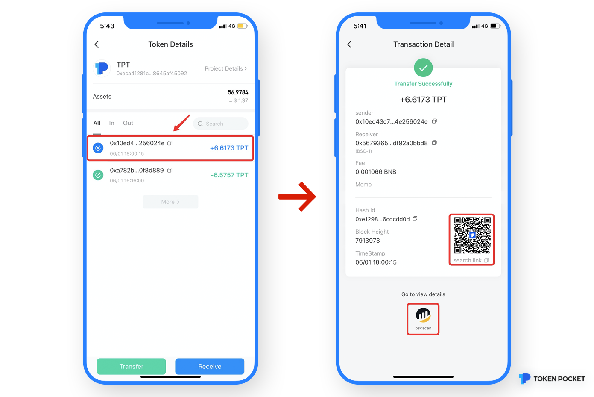
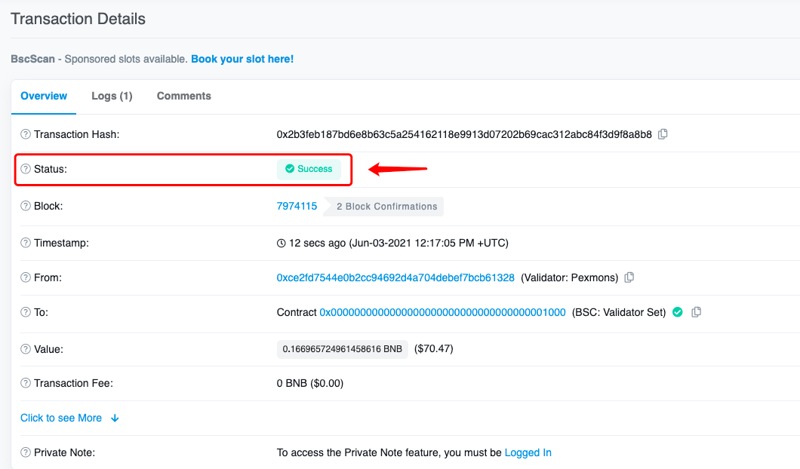

# Why did I not receive my funds from the exchange to the wallet?

First, the route of transfer on the blockchain is divided into three steps: **Transfer from the exchange - Confirmation on the blockchain - Transfer into the wallet. **

If you didn't receive your assets when depositing tokens/coins from the exchange to TokenPocket, please follow the steps below: 

1\. Confirm whether the exchange/centralized wallet initiated the transfer to the withdrawal address. If not, please contact the customer service of the sender for help. If the transfer was initiated, a transaction hash will be generated, and the user can check the transaction details through the transaction hash (The way of checking explorer is on the below).

2\. Check the transaction details on the chain. Due to network congestion or the low gas fee setting, transaction on the chain may be shown on \[Pending] or \[Fail] status, which indicates that the transaction has not been completed, so your funds will not arrive the wallet. In this case, please wait patiently to pack your transaction, or contact the customer service of the exchange to cancel the transaction, and then re-initiate a transfer with a higher gas fee. 

**How to view transaction details on the blockchain? **

1\) Open TokenPocket, select the receiving token, click the token link after entering the \[Token Details], and enter the \[Transaction Detail] page, you can scan the code or click the icon below to view the details on the blockchain.

2\) You may check the \[Status] to judge the transaction.

3\. If the status is "success" but the asset has not arrived, you should manually add the token on the wallet asset page. If the token assets are still displayed as zero, there are three possibilities:

1\) The token has the same name. Please confirm the contract address of the token, add the corresponding token address, and the assets will be displayed;

2\) Transfer through a wrong blockchain. Errors are often raised between EVM chains. If you transferred through a wrong blockchain, you need to import the private key into the corresponding chain to retrieve the assets; (For specific steps, please click [Here](https://tp-lab.tokenpocket.pro/AssetsFind/index.html?locale=en#/))

3\) The receiver address or contract address is incorrectly filled. In this case, you need to contact the owner of the address, but the probability of retrieving it is extremely low.

Tip: The essence of transfer from an exchange to a decentralized wallet is to transfer assets to the chain. So, if the assets haven’t arrived, it doesn’t mean that your assets are lost. 

**Common Blockchain Explorers**\
****[Ethereum](https://cn.etherscan.com)\
[BscScan](https://bscscan.com)\
[HecoInfo](https://hecoinfo.com)\
[Tronscan](https://tronscan.io/#/)
