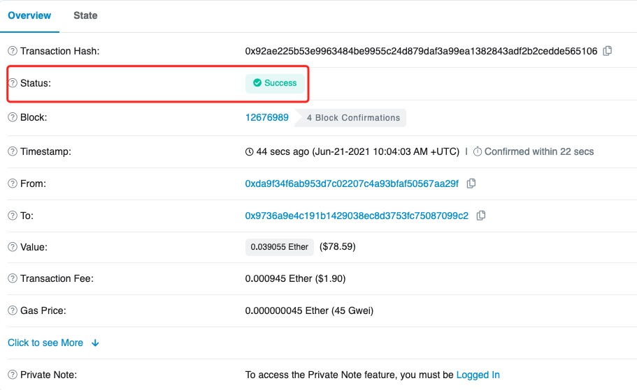
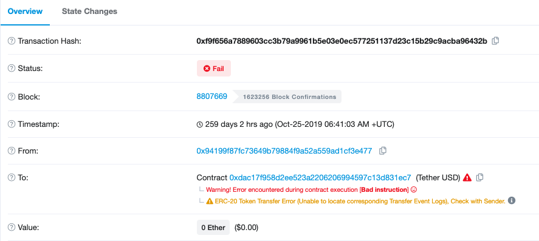
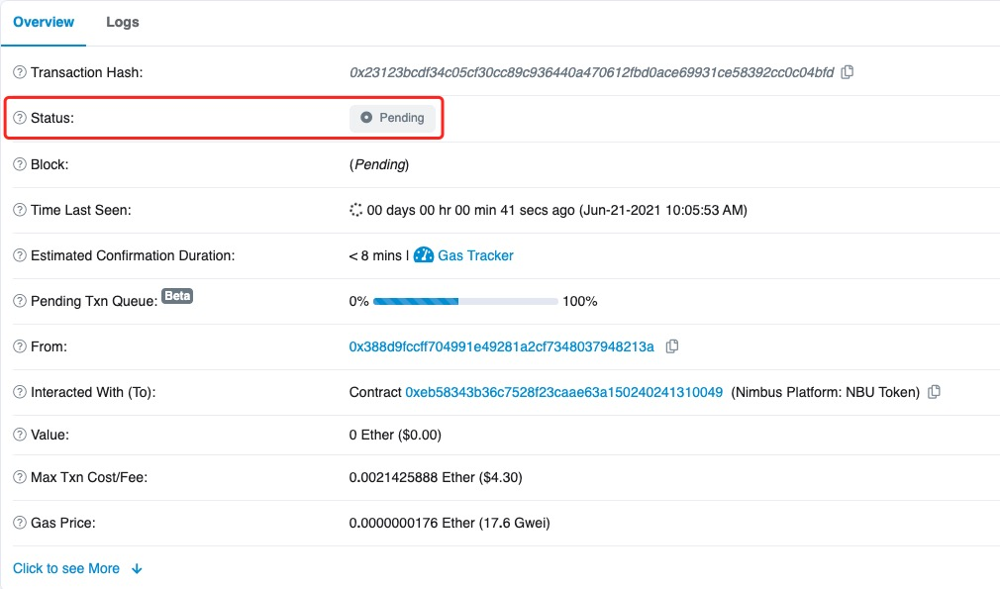

# Why did I not receive my funds from the wallet to the exchange?

First of all, transfer on the blockchain is divided into three steps: **Transfer from the wallet - Confirmation on the blockchain - Transfer into the exchange.**&#x20;

If you've transferred tokens from TokenPocket but didn't receive it on the exchange, please follow the steps below:&#x20;

**1. Check whether the transaction has been transferred out:**\
****After submitting a withdrawal on TokenPocket, the withdrawal record will be displayed on the \[Transfer] page. Once the transaction ID is generated, it means that the withdrawal is already on the chain, and the wallet withdrawal process is completed. At this time, you need to click Transaction ID to view the details on the chain. (The way of viewing details on blockchain is on the last section of the page)&#x20;

**2. Check the transaction details on the blockchain**:\
According to the characteristics of different blocks, each transfer will take a certain amount of time to be confirmed by the block and then sent to the receiving platform.&#x20;

1\) When the blockchain shows pending status, or the number of block confirmations has not reached the number required by the exchange, please wait patiently. After the blockchain has been confirmed, you will receive your assets;&#x20;

2\) When the blockchain shows that it has been confirmed, but the funds have not yet arrived, you can contact the exchange customer service for help.&#x20;

According to the characteristics of different blocks, each transfer will take a certain amount of time to be confirmed by the block and sent to the receiving platform. The "number of confirmations" required for different tokens/coins will also be different. For example, depositing BTC requires 1 block confirmation to arrive, while ETH requires 12 confirmations. Moreover, different exchanges have different regulations for block confirmations, so this needs to be based on the exchange.&#x20;

**How to view my transaction on the blockchain?**&#x20;

1\. After withdrawing tokens from TokenPocket, click the transaction ID in the \[Transfer] record, and then scan the code or click the icon at the bottom of the page to check on the chain;&#x20;

 (1).png>)

2\. After entering the blockchain page, check the \[Status].

1\) If it displays \[Success], it means that the withdrawal has been completed in the block. If the asset is not received, you need to contact the customer service of the exchange for processing.

2\) If it shows \[Fail], it means that the withdrawal has failed. A large part of the reason is due to insufficient gas fees. You can check whether the asset has been deducted in TokenPocket. If not, you can resend a withdrawal with a higher gas fee.&#x20;

Note: Even if the transaction fails, the paid Gas will not be refunded.

3\) If it shows \[Pending], it means that the withdrawal is pending to confirm. At this time, you need to wait patiently for the block to pack your transaction, or increase the gas fee to speed up the transaction.

**Attention:** Due to the irreversibility of blockchain transfers, TokenPocket cannot cancel or refund successful transactions. Only the recipient (Exchange) can help you retrieve the assets.

**Common Blockchain Explorers**\
****[Ethereum](https://cn.etherscan.com/)\
[BscScan](https://bscscan.com/)\
[HecoInfo](https://hecoinfo.com/)\
[Tronscan](https://tronscan.io/#/)

