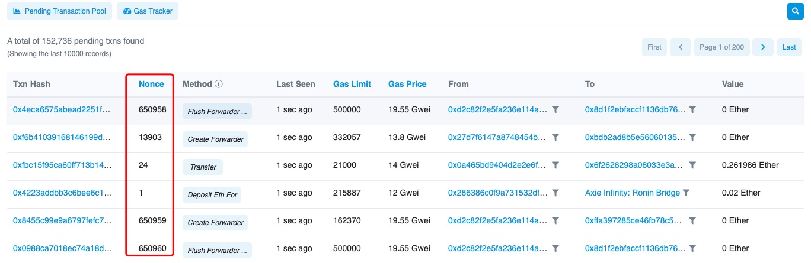

# Why does the transfer always show pending status?

There are probably two reasons. **One** is that there are congested transactions on the blockchain. At this time, you can increase the gas fee to speed up your transaction, or wait the blocks to pack your transaction. **Second** is that you choose a low miner fee when you transfer. The miner will prioritize the transaction with high gas fees, therefore, your transfer will show pending status. At this time, increasing the gas fee to speed you up transactions is recommended. 

In order to better understand why transfers are always being packaged, we need to understand a term: Nonce \(Number once\). Nonce is a number that can only be used once in encrypted communication. In authentication protocols, it is often a random or pseudo-random number to avoid replay attacks. 

On blockchain, every transaction has a nonce, which is used to calculate the number of transactions issued in an blockchain address. All transfers on blockchain will be sorted according to the time you initiate the transfer, counting from 0. Each time the address sends a transaction, the nonce of the transaction will increase by 1, and the transaction transferred to this address will not change the nonce.

For the nonce, the blockchain has three rules: 

1. Miners need to package and transfer the transaction according to the nonce from small to large, so if a transaction with nonce 0 is not packaged by the miner, other transactions with nonce 1, 2, 3··· must be waiting in line regardless of how high the miner’s fee is paid. 

2. The nonce is continuous and cannot be skipped. When a transaction with a nonce of 1 is not initiated, the nonce cannot jump directly from 0 to 2, that is, a transaction with a nonce of 2 can only be ****packaged after a transaction with a nonce of 1. 

3. If there are two transactions with the same nonce, after one of the transactions is successful, the other transaction will be replaced, that is, the transfer is failed. 

Therefore, the principle of accelerating the transfer is very simple, that is, initiating another transfer with the same nonce but higher miner fees to cover the original transfer. In this way, the transaction will be packaged faster to cover the original one.

**Related tutorials**  
1\) ****[Manage the unpackaged transactions](https://tphelp.gitbook.io/en/faq-en/eth-wallet/unpackaged)  
2\) [How to cancel/accelerate my transaction?](https://tphelp.gitbook.io/en/transfer-tutorial/how-to-cancel-or-accelerate-my-transaction)

