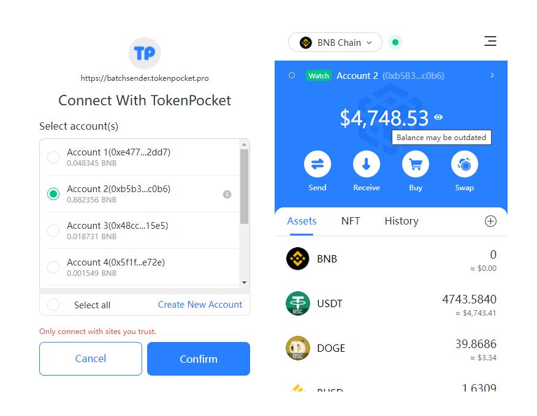

# TokenPocket Multi-chain Token Batch sender

#### Introduction to the Token Batch sender:

TokenPocket multi-chain token batch sender supports more than a dozen EVM-compatible chains such as ETH, BSC, HECO, OKXChain and Polygon, which greatly simplifies the transfer process, and lowers fees with easy access.

#### About VIP service:

Join VIP, and you can enjoy unlimited free bulk transactions

Please note, you still have to pay for the mining fees.

If you are not a VIP member, you need to pay fees for each batch transfer.

#### Please pay attention to the following points:

1、The receiving address and amount must be separated by comma;

2、It is recommended to use PC (TokenPocket extension wallet) to operate, which can quickly load text and import addresses in bulk;

3、If you transfer to an exchange address, please make sure that the exchange supports contract transfer, otherwise your transfer will not be credited to your account.

#### The tutorial for Token Batch Sender:

1、Open the multi-chain token batch sender link [<mark style="color:blue;">**https://batchsender.tokenpocket.pro/#/**</mark>](https://batchsender.tokenpocket.pro/#/)<mark style="color:blue;">****</mark>

.png>)

Entering the website can automatically call the TokenPocket extension, then choose the addresses to connect.

2、The multi-chain token batch sender supports VIP services. Click “Join VIP” on the homepage, and choose 1-day, 7-day and 31-day services according to your actual needs. The fee of each service varies from period.

.png>)

#### 3、**Preparation**

choose the token you want to transfer, click the list to see the tokens you hold, and you can also directly enter the contract address to set up. CSV files can be uploaded on the PC, so you can import the prepared addresses and amount quickly. The notes at the bottom should also not be ignored.

 (2).png>)

If you use it for the first time, you can download the template to edit, then click “Upload File” to load it.

.png>)

#### 4、Approving & Confirmation

Tokens other than the native coin need to be authorized for the first operation. Here authorization is thoughtfully divided into “precise authorization” and “unlimited authorization”. Users can choose according to their own needs. In the “Summary” list you can see the relevant information about the currently operating tokens.

**It should be noted that the addresses imported in batches will be allocated and sent in groups of 400 (the number may vary from public chains or tokens), so users can optimize according to this feature when setting addresses, and try not to waste gas fees.**

.png>)

After the approval, click “OK” at the bottom.

.png>)

#### 5、Send Transaction&#x20;

click “confirm” to call the TokenPocket extension wallet for approval, and it will be sent in a group of 400 addresses (this parameter will vary from tokens or public chains). After three confirmations, all the steps of the batch operation are completed.

.png>)
