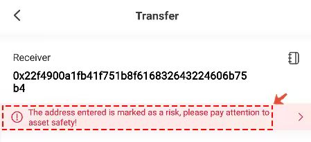

# About Safe Transfer

Safe transfer warnings are divided into two parts:

**Part 1: Risk**

The address has been reported by many people or marked as a risk address, there are hidden risks, and there is  risk warning;

**Part 2：Contract**

To mark the contract address as a risk is a measure to prevent some new users from using the contract address as the received address.

For the above two safe transfer warnings, we recommend that you need to **stop related operations to avoid asset losses.**

