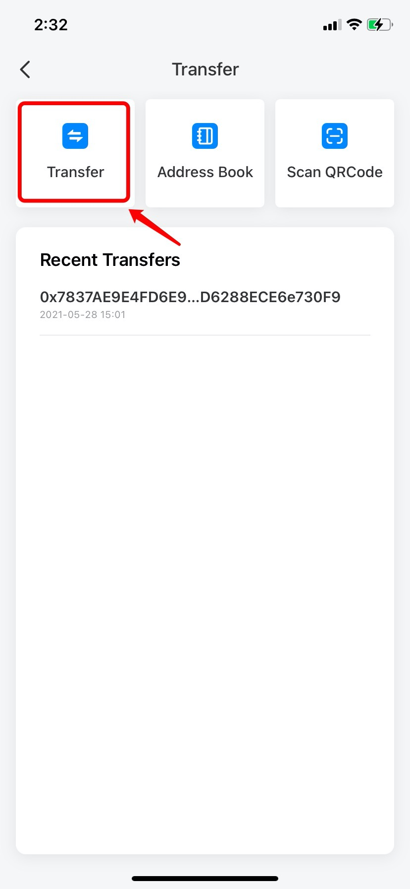
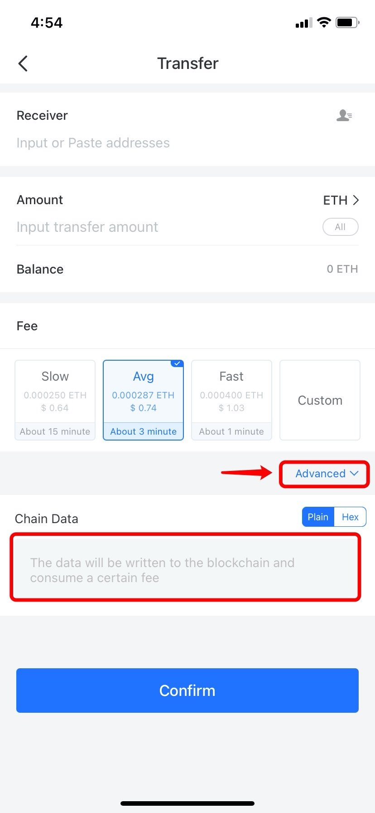

# How to Add Memo When Transferring?

1.Open TokenPocket App, choose the coin you need to transfer; (Take ETH as an example here)

Reminder: In general, only coins such as ETH, BNB, HT and so on can be added memo. But tokens on EOS and IOST chain also can do that.

.jpg>)

2\. Choose and click \[Transfer]; (You can also use the function of \[Address Book] or \[Scan QR Code] to transfer)

3\. Enter \[Receiving address] and \[Amount], set the miner fee, click \[Advanced] in the bottom right corner, and then you can choose \[Plain] or \[Hex], fill in your memo on the \[Chain Data] line, and then click \[Confirm].

4\.  After completing the payment, you've submitted a transfer attached memo successfully. 
