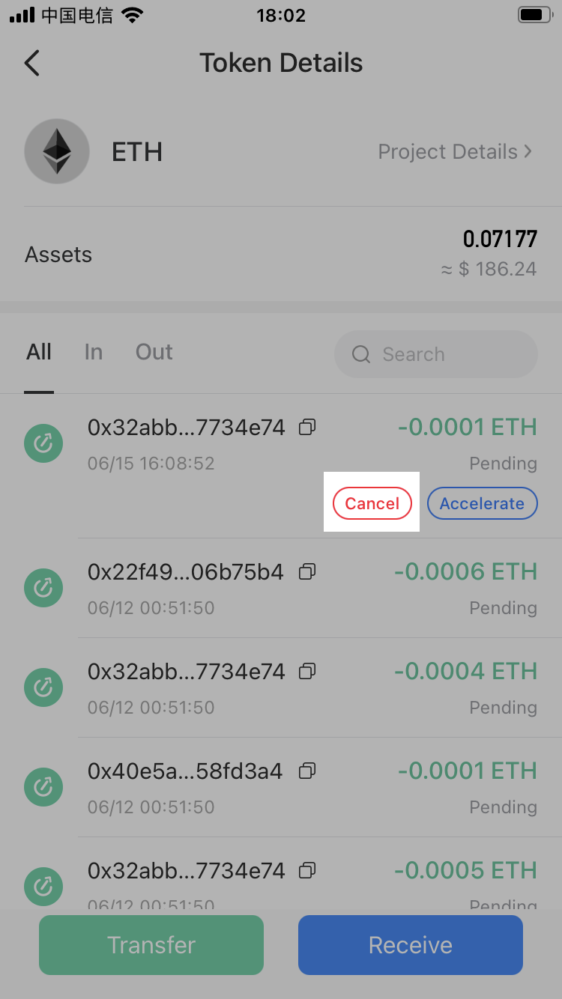
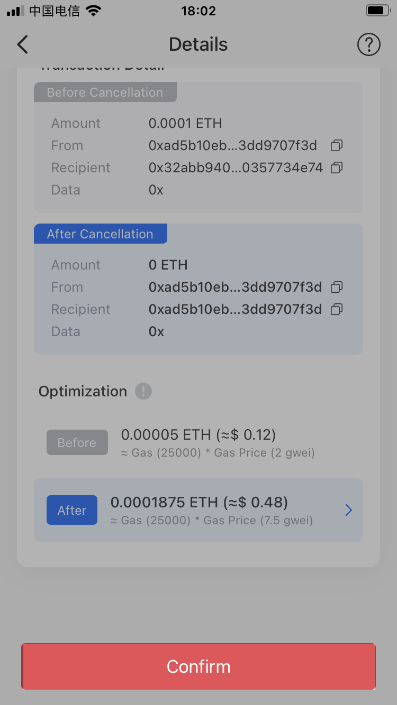
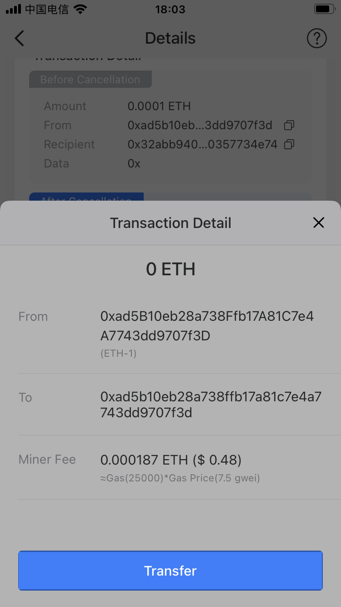
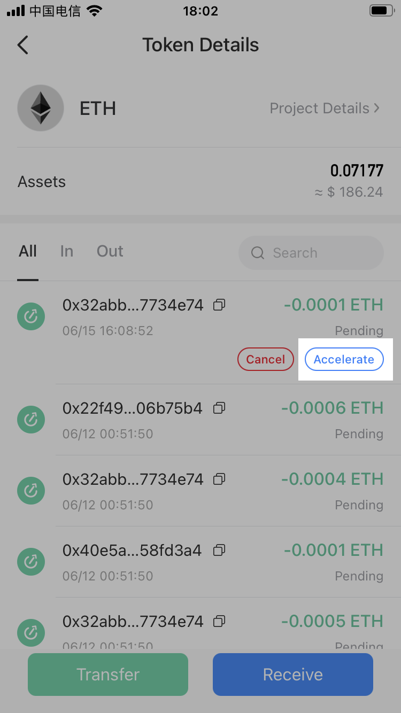
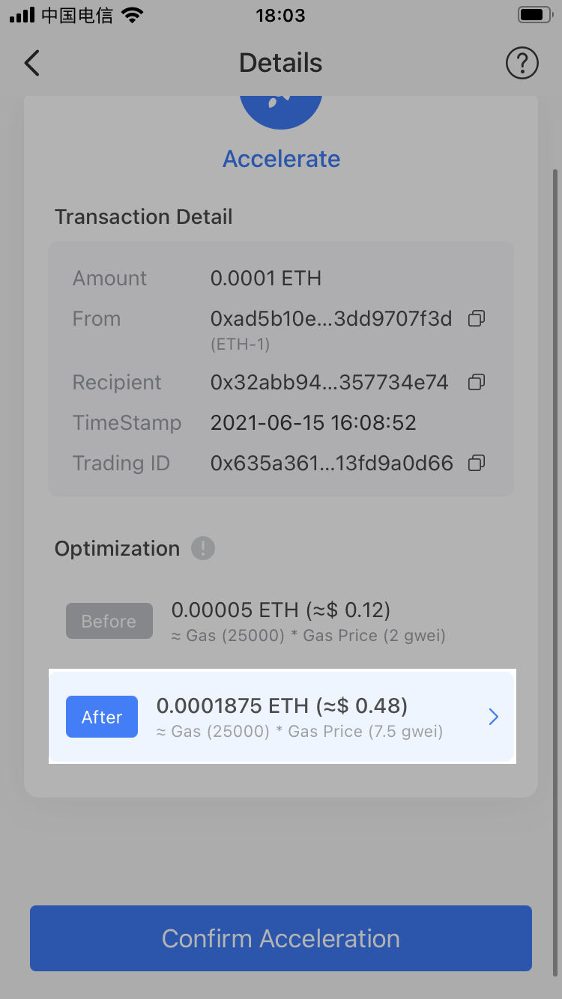
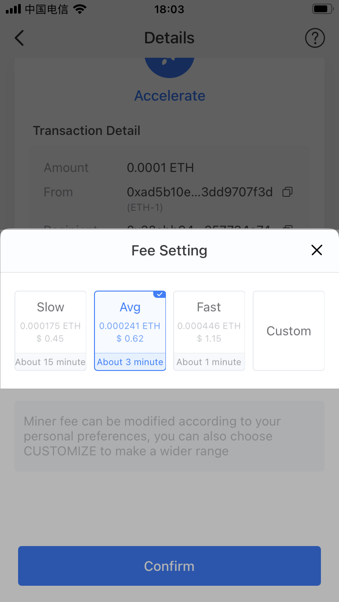
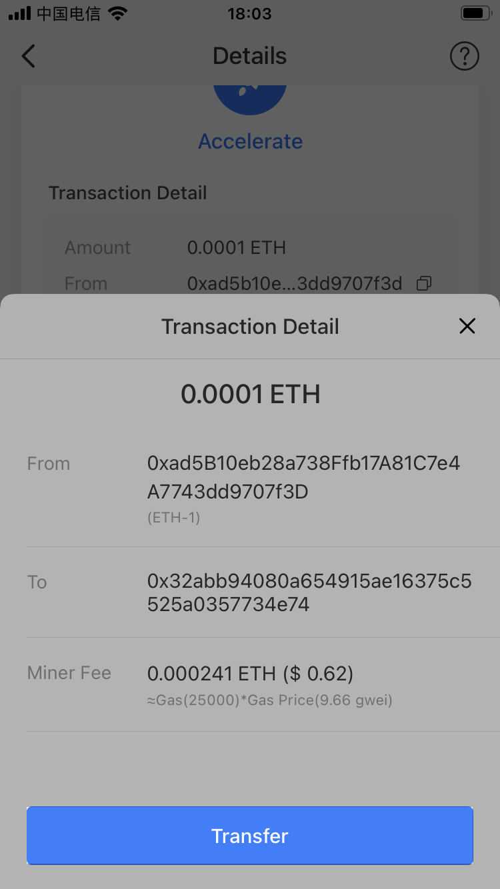
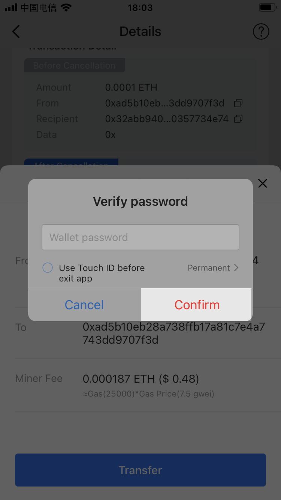

# How to Cancel/Accelerate My Transaction?

In general, transactions on the Ethereum chain are relatively congested, and transactions can only be cancelled or accelerated before they are packed by miners, that is, transaction ID has not been generated on the blockchain.

**How to cancel a transaction?**

1. Open TokenPocket App, choose the transaction you need to cancel, and then click \[Cancel\]; \(Take canceling ETH transfer as an example\)

2. You can check details after entering the page, and then click \[Confirm\];

3. After checking the information, click \[Confirm\];  
Note: The principle of canceling a transaction is to re-initiate a transfer of the same amount to cover the original transaction you sent, and this process also needs to be executed on chain, so a small amount of miner fee is still required.

4. After entering wallet password, your transaction will be cancelled successfully.

**How to accelerate a transaction?**

1. Open TokenPocket App, choose the transaction you need to accelerate, and then click \[Accelerate\]; \(Take accelerating ETH transfer as an example\)

2. ****Click \[After\] to set the miner fee after entering the page, or remain the default status;

3. You can set the miner fee according to your own needs, or you may click \[Custom\] to set gas price and gas limit, and then click \[Confirm\];

4. Click \[Confirm Acceleration\] ;

5. Click \[Transfer\] after double checking the information;

6. Enter your wallet password, and then click \[Confirm\] to complete the acceleration.

