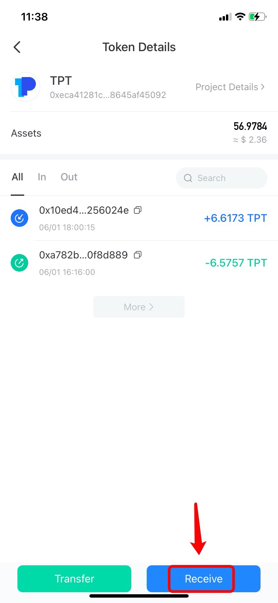

# How to Receive My Assets ?

1.Open TokenPocket App, choose the receiving token in the \[Assets\] Page; \(Take receiving TPT through BSC network as an example\)

2. Click \[Receive\];

3. You can click \[Copy\] or \[Scan QR code\] to copy the recipient, and then paste the receiving address to the withdrawal page of exchanges or decentralized wallets.

**Notes:**  
1\) Please double confirm that you select a same network \(blockchain\) before transferring.  
2\) If your assets are not displayed on wallet after transferring, please check whether you add tokens.

**Related tutorials**  
How to add tokens ?   
****

