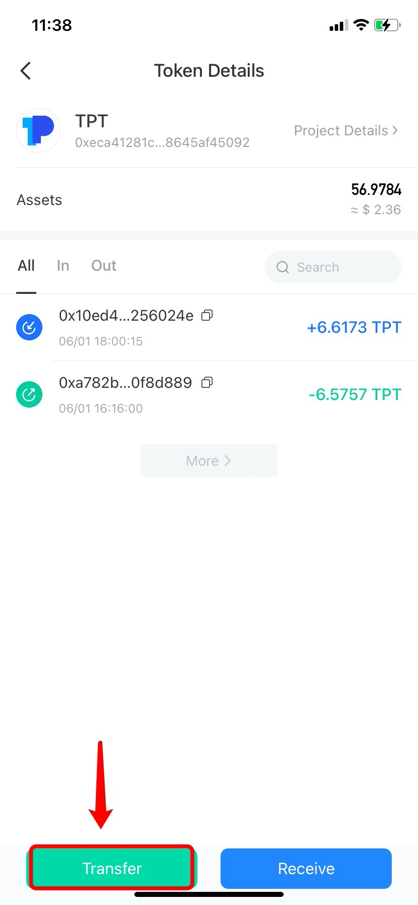
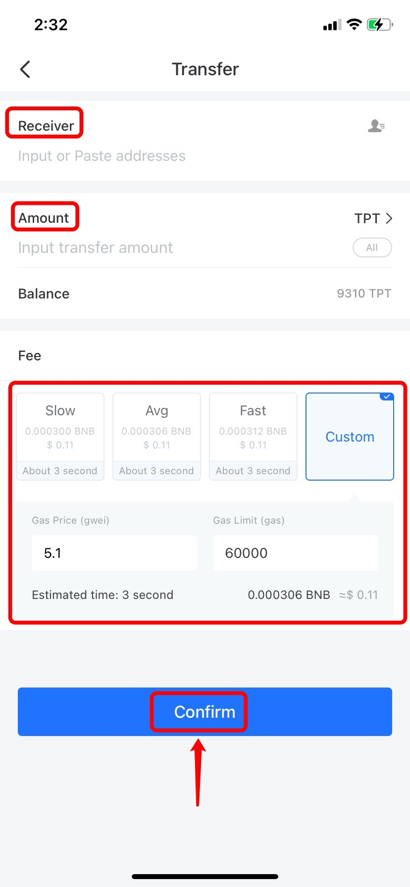
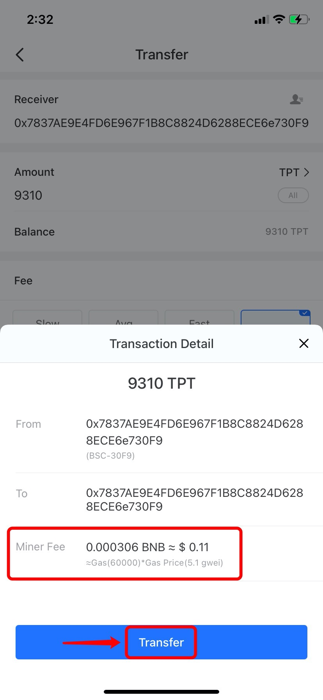
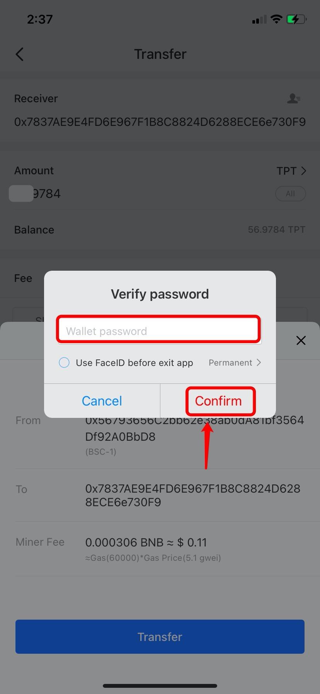

# How to Transfer Assets to the Wallet/Exchange?

1.Open TokenPocket App, choose a token you need to transfer on the \[Assets] page; (Take withdrawing TPT on the BSC wallet as an example)

.png>)

2\. Click \[Transfer] on the bottom of the transfer page;

3\. Choose and click \[Transfer];

Notes: 1) Click \[Address Book] for choosing a receiving address stored in book;\
2\) Click \[Scan QR code] for scanning code of the receiving address.

.jpg>)

4\. Enter \[Receiving address] and \[Amount], and then choose miner fee (Usually, Avg fee is recommended), click \[Confirm].

**Notes:** \
1\) Please attach Memo/Tag if the platform of receiving address is required when you transfer.\
2\) You may custom the miner fee to adjust gas price and gas limit.

5\. After checking the transfer information, click \[Transfer];

6\. Enter wallet password, and click \[Confirm];

**Notes:**\
****1) Please check whether the receiving address accepts the token before transferring;

2\) Please make sure that you have enough miner fees in your wallet before transferring. For example, you need to have enough BNB as miner fees if you choose BSC wallet to transfer.

3\) Please make sure that the token you need to transfer and receiving address are on the same blockchain when transferring. For example, if you choose BNB-BSC as your receiving address, you should choose BSC wallet to transfer.

**Related contents**\
****1) [Why can't I transfer my assets to the contract address?](https://tphelp.gitbook.io/en/wallet-operation/do-not-transfer-to-the-contract-address)\
2\) [What should I do if I transfer my assets through the wrong chain?](https://tp-lab.tokenpocket.pro/AssetsFind/index.html?locale=en#/)\
3\) [Why did I not receive my assets from the wallet to the exchange?](https://tphelp.gitbook.io/en/transfer-faq/why-did-i-not-receive-my-funds-from-the-wallet-to-the-exchange)\
4\) [How to Add Memo When Transferring?](https://tphelp.gitbook.io/en/transfer-tutorial/how-to-add-memo-when-transferring)
