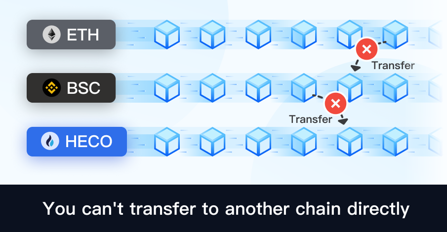

# Why can't transfer tokens between different chains?

With the development of public chains, exchanges are also launching their own public chains, such as the Binance Smart Chain (BSC) launched by Binance, the Huobi Eco Chain (HECO) launched by Huobi, and OKExChain launched by OKEx.

The same asset will appear on different public chains due to the increasing demand for cross-chain. For example, USDT can be circulated in ETH, TRX, BSC, HECO, etc., but they are not completely consistent and cannot be transferred directly to each other. Moreover, the address formats of ETH, BSC, HECO, and OKExChain are all the same, which often leads to errors in user transfers or withdrawals.

**Be careful:**&#x20;

1\. Different public chains cannot transfer the tokens to each other directly. For an example, USDT on Ethereum cannot be transferred to HECO directly.&#x20;

2\. When withdrawing tokens from exchanges, please pay attentions to choosing the right withdrawing channel/blockchain. For an example, if you want to withdraw from Binance to Binance Smart Chain, you must choose the BEP20 or BSC option. For another example, if you want to withdraw from Huobi to the Huobi Eco Chain, you must select the HECO option, otherwise the tokens cannot be received.

**What should I do if I withdraw or transfer through the wrong channel (chain) ?**&#x20;

1\. If the direct transfer goes wrong, such as directly transferring USDT from Ethereum wallet to BSC wallet. In this case, the BSC wallet cannot receive the tokens. You need to import the private key of the BSC wallet into Ethereum and then the USDT will be appeared (If you cannot see USDT in the wallet, you can add the token manually).&#x20;

2\. Choosing the wrong channel when withdrawing on exchange. For example, if you want to withdraw USDT to HECO, but forgot to choose the channel or choose the wrong channel to Ethereum, you can import the private key of your wallet on HECO into Ethereum and the USDT will be appeared (If you cannot see USDT in the wallet, you can add the token manually).
