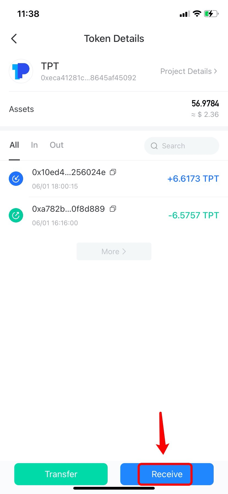

# How to Receive My Assets ?

1.Open TokenPocket App, choose the receiving token in the \[Assets] Page; (Take receiving TPT through BSC network as an example)

 (1).png>)

2\. Click \[Receive];

3\. You can click \[Copy] or \[Scan QR code] to copy the recipient, and then paste the receiving address to the withdrawal page of exchanges or decentralized wallets.

**Notes:**\
****1) Please double confirm that you select the same network (blockchain) before transferring.\
2\) If your assets are not displayed on your wallet after transferring, please check whether you add tokens.

.png>)

**Related tutorials**\
****[**1)** How to add tokens? ](https://tphelp.gitbook.io/en/token-management/how-to-add-tokens)\
[2) How to transfer assets to the wallet/exchange?](https://tphelp.gitbook.io/en/transfer-tutorial/how-to-transfer-assets-to-the-wallet-exchange)\
[3) Why can't I transfer tokens between different chains?](https://tphelp.gitbook.io/en/transfer-faq/about-public-chain-transfer)\
[4) Why did I not receive my assets from the exchange to the wallet?](https://tphelp.gitbook.io/en/transfer-faq/why-did-i-not-receive-my-funds-from-the-exchange-to-the-wallet)****\
****
