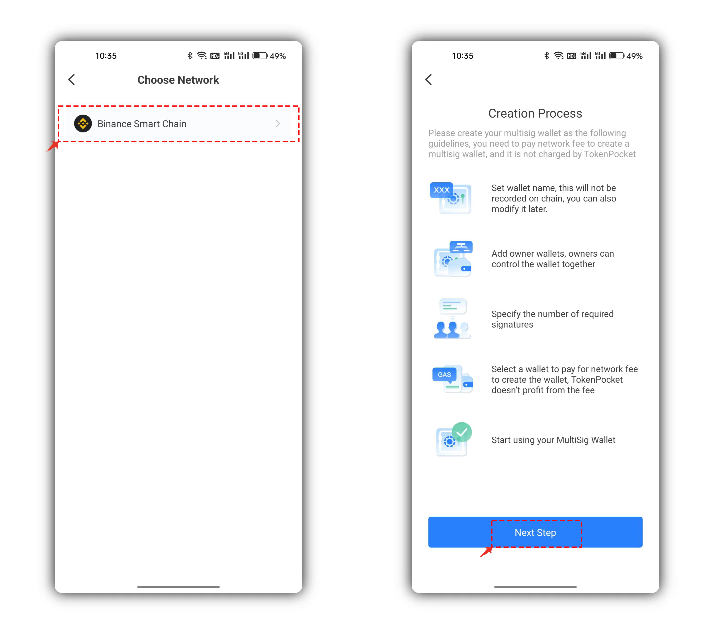

# How to create a MultiSig Wallet?

## **What is a MultiSig wallet?**

Generally, all the on-chain operations need to sign by private key, and the private key signature is equivalent to the process of permission verification. The wallet is divided into single-sig wallet and multi-sig wallet. The single-sig wallet is controlled by a private key. For example, the common wallet we use at present is the single-sig wallet. The multi-sig wallet is jointly controlled by 2 or more private keys. The private keys holders of the multi-sig wallets are the managers.&#x20;

Therefore, when the multi-sig wallet needs to execute the on-chain operation, the managers need to sign according to the weight.

The ETH/ERC20(Including the EVM-based chains like BSC/BEP20, etc.) MultiSig wallet using the smart contract to sign.

#### Applicable scenes:

1\. Manage assets by multiple persons to avoid the misappropriation of assets by individuals;

2\. Perform multi-address signature management for assets to enhance asset security.

3\. Other security scenarios.

## **Create a MuitiSig wallet**

1. Open TokenPocket and click \[No accounts] for the first time, and choose \[MultiSig Wallet]. You can also click the icon on the upper right corner to create a multisig wallet.

<figure><figcaption></figcaption></figure>

2\. You need to choose the public chain before you create a multisig wallet, please read the reminders carefully during the creation process and then click \[Next Step].

<figure><figcaption></figcaption></figure>

3\. The steps of creating a multi-signature wallet are the core content.&#x20;

\[Wallet Name] is as same as the wallet name you created before, which can be customized and it won’t be recorded on chain.

\[Owners] is to set the managers of the multisig wallet. The owners can manage and control the multisig wallet and a maximum of 30 owners can be set, which can be understood as the \[Threshold Setting] of the multisig wallet. The owners can be set up flexibly, it is suitable for enterprises, DAO, and individuals.&#x20;

\[Required Signatures] it’s also called Weight, the difference between EOS/TRON multisig wallets and EVM multisig wallets is that EOS/TRON multisig wallets’ weights can be set as 1 or greater, while EVM-based multisig wallets’ weights can only be set as 1.&#x20;

\[Payment Details] The multisig scheme of an EVM-based chain is a smart contract, so creating a multsig wallet requires paying Gas (miner's fee), which TokenPocket does not charge.\
\[Pay with] You can click and select the wallet address imported in the wallet to pay the Gas (miner's fee) fee.

After everything is set, click \[Confirm] to read the reminders for the creation of the multisig wallet. You can also read the information of this creation on the blockchain explorer.

\

<figure><figcaption></figcaption></figure>

4\. After the smart contract is deployed successfully, you've successfully created a multisig wallet. Click the upper-left menu of the wallet, and you can distinguish the difference between the multisig wallet and the single-sig wallet in the list, and it will be more convenient for you to switch the wallet.

<figure><figcaption></figcaption></figure>

5\. After you’ve successfully created a multisig wallet, click \[Details] and you can see the \[Transaction Queue] and \[Manage].

<figure><figcaption></figcaption></figure>

6\. \[Transaction Queue] will display the generated multisig order, you can click and complete the order; You can view information such as \[Required signatures], \[Latest Nonce on-chain], and \[Associated Wallet] in \[Manage], the associated wallet is the owners. If there is an address that has not been imported, you can click \[Import] and use the private key or secret recovery phrase to import it. Whether the associated wallet is imported will affect the transaction and the use of DApps.\

<figure><figcaption></figcaption></figure>

To sum up, the multisig wallet on the EVM-based chain is a smart contract. Creating a multisig wallet does not require backing up the secret recovery phrase or private key, does not require setting a password, does not require complex code, and is similar to the watch wallet.

The key point of creating a multisig wallet is the reasonable setting of \[Owners] and \[Required signatures]. A reasonable set of the multisig wallet can play its maximum security and convenience. The commonly used multiple signatures are 2/3, 3/5, and so on, which need to be selected according to the individual situation.
