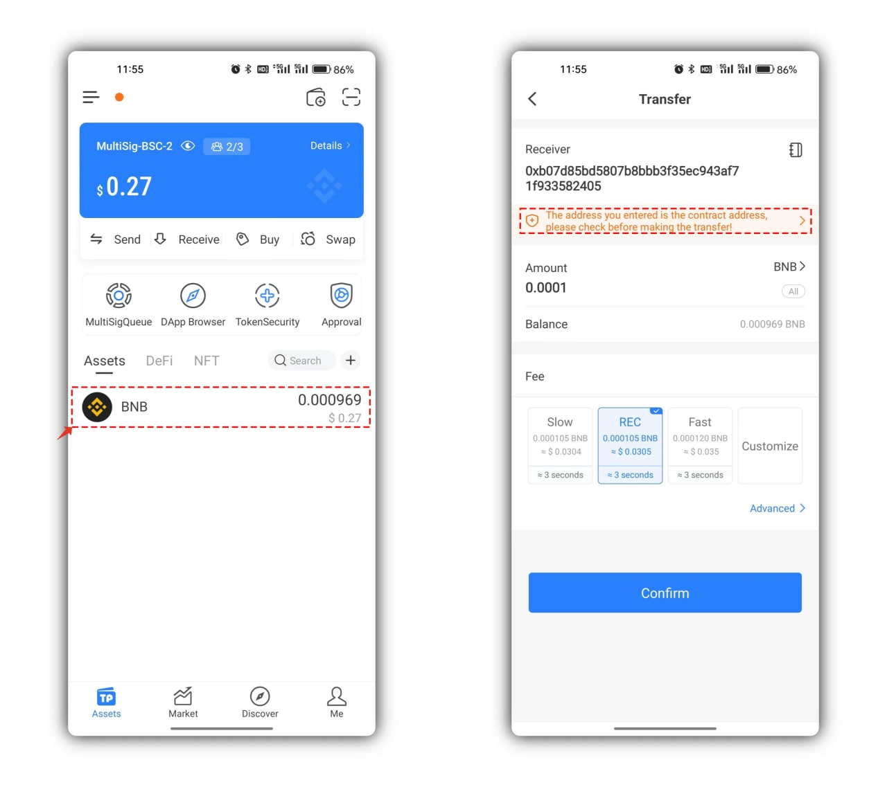
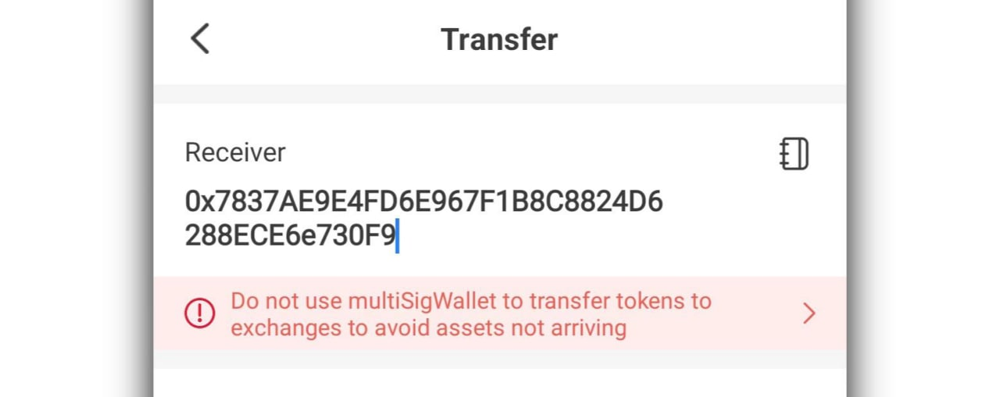
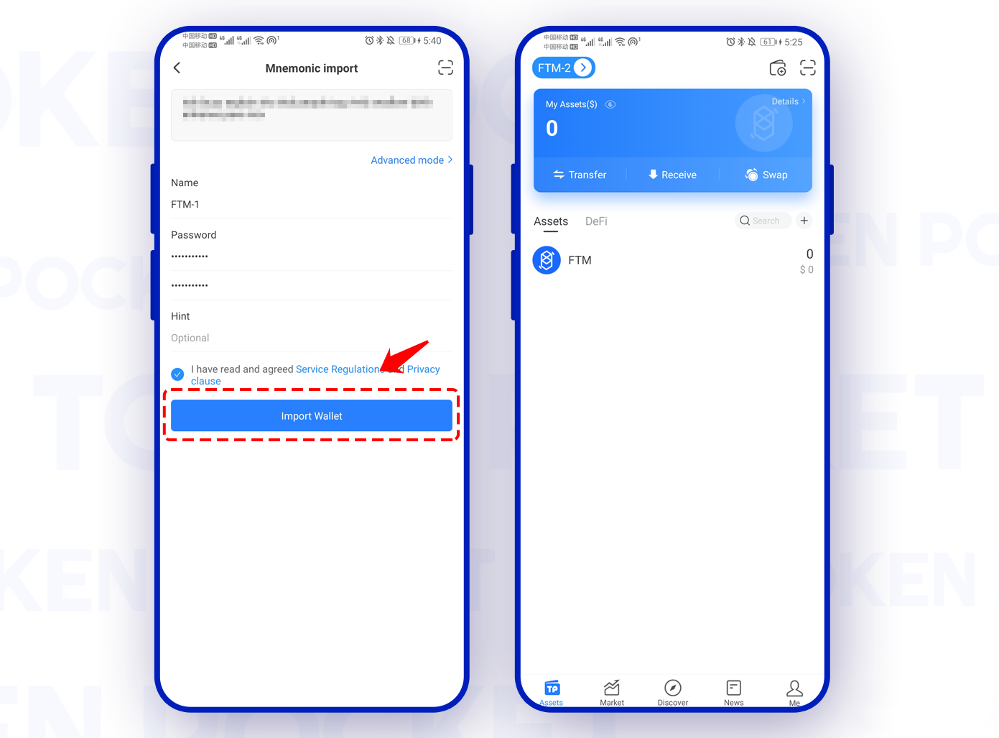

# MultiSig Transfer Use Guide

Open TokenPocket MultiSig wallet, select the token/NFT you want to transfer, take $BNB as an example here.&#x20;

1\) When you transfer to a MultiSig wallet address, it will remind you that “<mark style="color:red;">**The address you entered is the contract address**</mark>”, so please pay attention and double-check the receiving address. Do not transfer to the token contract address.

<figure><figcaption></figcaption></figure>

2\) When you transfer to a normal wallet address, it will remind you that “<mark style="color:red;">**Do not use multiSigWallet to transfer tokens to exchanges**</mark>”.

<figure><figcaption></figcaption></figure>

<mark style="color:red;">**Attention, MultiSig wallet address and normal wallet address can be used as the receiving address of the MultiSig wallet transfer. The exchange wallet address can’t be used as the receiving address of the MultiSig wallet transfer, ‘cause exchanges don‘t support receiving the contract transaction, if you transfer to the exchange, please contact the exchange’s customer service.**</mark>

2\. The contract address detection function is built in TokenPocket, so you can view a reminder here, after you’ve double-checked the receiving address and confirmed, you can click \[Know and Continue]. Also, you can customize nonce in \[Advanced mode].\

Know more about Nonce.

<figure><figcaption></figcaption></figure>

TokenPocket can't delete the order in the MultiSig queue now, so if you've created multiple unexecuted orders, but you need to create a new order and let it execute first, there are two ways to do this.

1\) Execute all the orders according to the nonce in the queue.

2\) Customize the nonce with the value of "0" and all the orders with the "0" nonce will disappear from the list after the execution was successful.

<figure><figcaption></figcaption></figure>

3、**1) Owners' addresses didn't import in your current wallet.**

After you've confirmed the order, click \[Coinfirm] and you will be reminded to select Owner, you need to click \[Manually send to other owners to sign]. Then, according to the setting of  \[Required signatures] to \[Share to owners to sign].

<figure><figcaption></figcaption></figure>

**2) All the owners' addresses have been imported into your current wallet.**

After you've created a transaction, and the owners' addresses have been imported into your current wallet, you need to select the owners in the list and click \[Manage] to sign.

<figure><figcaption></figcaption></figure>

Then you just need to select another owner's address and confirm the transaction.

<figure><figcaption></figcaption></figure>

**2) A part of the owners' addresses have been imported into your current wallet.**

You need to share the QR Code of MultiSig transaction with the other owners, after they executed the signatures, click \[Execute], then the transaction would be executed on-chain.

<figure><figcaption></figcaption></figure>

4\. You need to pay the gas fee for the transaction, and you can select a wallet on the list which has enough gas fees.

<figure><figcaption></figcaption></figure>
