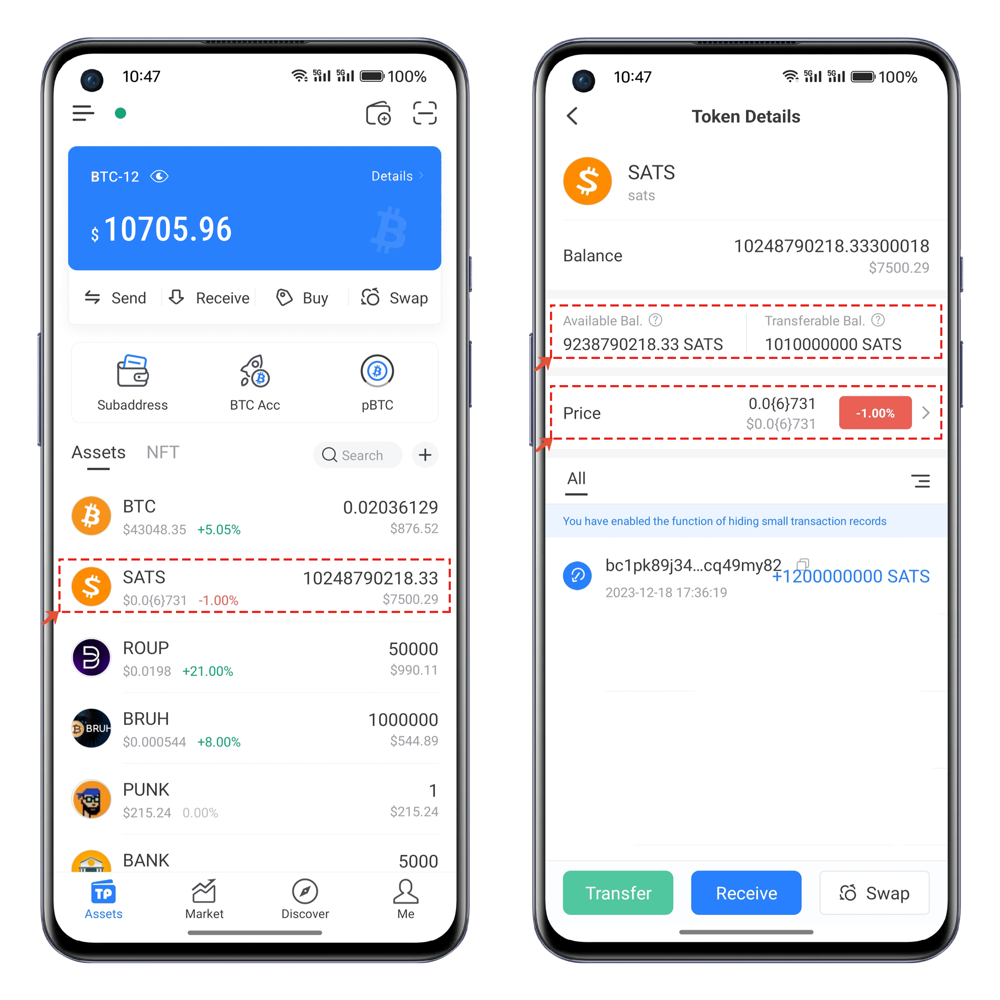

# How to receive and transfer BRC-20 assets.

### <mark style="color:orange;">Receiving BRC-20 assets.</mark>

Open TokenPocket, click on the "Receive" menu. On the receiving interface, you can use the receiving address to accept BRC-20 assets. The address type can be selected by clicking, and there are four different types of Bitcoin address options. (For BRC-20 assets, only the Taproot address type can be used for receiving.)

<figure><figcaption></figcaption></figure>

### <mark style="color:orange;">To transfer BRC-20 assets</mark>

In the Android version 1.9.5, support for displaying, pricing, and transferring BRC-20 assets has been added. Simply click on the asset you want to transfer, and in the details, you will find information such as "Available Balance," "Transferable Balance," "Market Price," and more.

<figure><figcaption></figcaption></figure>

Transferring BRC-20 assets is quite unique; the previous process involved engraving the available assets into transferable runes and then sending these runes to the recipient's address. This process required two steps and, in case of network congestion on the BTC network, could lead to longer waiting times. This method presented several inconveniences.

Now, TokenPocket has simplified the transfer process of BRC-20 assets by merging the two steps into a single signed transaction. This streamlines the transfer, making it more convenient. The execution process can be categorized into three specific transfer scenarios.

#### Scenario One: Transferring transferable assets (engraved but not yet transferred).

Because BRC-20 transfers require engraving to be completed first, there might be a considerable wait during this process. After the engraving is completed and imported into TokenPocket, you will see the "Transferable Balance," indicating that only half of the transfer has been completed. If you only need to transfer it out, you just need to check this option. In the "Transfer Amount" at the bottom, you can see the data display for the first and third options. After clicking "Next," select the recipient address and set the appropriate miner fee to complete the transfer.

<figure><figcaption></figcaption></figure>

#### Scenario Two: Transferring available assets (not yet engraved).

In the "Transfer Amount" interface, you can see the "Available Balance" option, representing assets that have not been engraved. If you want to transfer these assets to someone else, you only need to set the quantity in the amount field. The corresponding parameters will change at the bottom in the "Transfer Amount" section. After that, proceed to the next step, select the recipient address, set an appropriate miner fee, and you can complete the transfer.

Typically, for unengraved assets, the traditional transfer method involves engraving them into a transferable rune in the first step and then transferring this rune to the recipient in the second step to complete the BRC-20 transfer. TokenPocket simplifies this process by integrating these two steps into a single transaction signature, making the transfer of BRC-20 assets more efficient and convenient.

<figure><figcaption></figcaption></figure>

#### Scenario Three: Composite asset transfer

In this scenario, the data represents a mixed-asset transfer type, including both engraved but not yet transferred BRC-20 assets and unengraved BRC-20 assets. The total transfer amount at the bottom combines the quantities of both types, displaying the sum of the engraved and unengraved assets. Users can proceed with the transfer by setting the recipient address and adjusting the miner fee accordingly.

<figure><figcaption></figcaption></figure>
