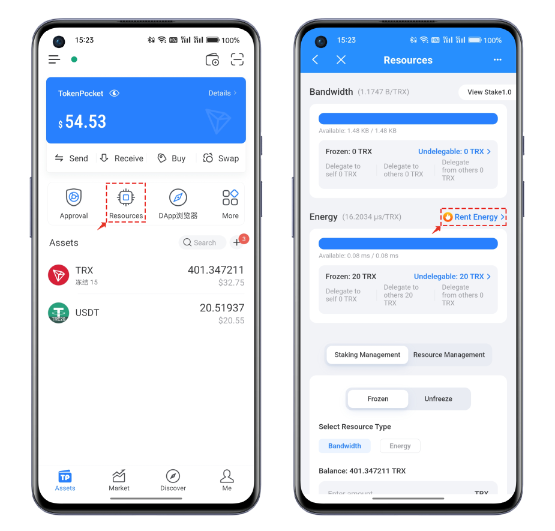
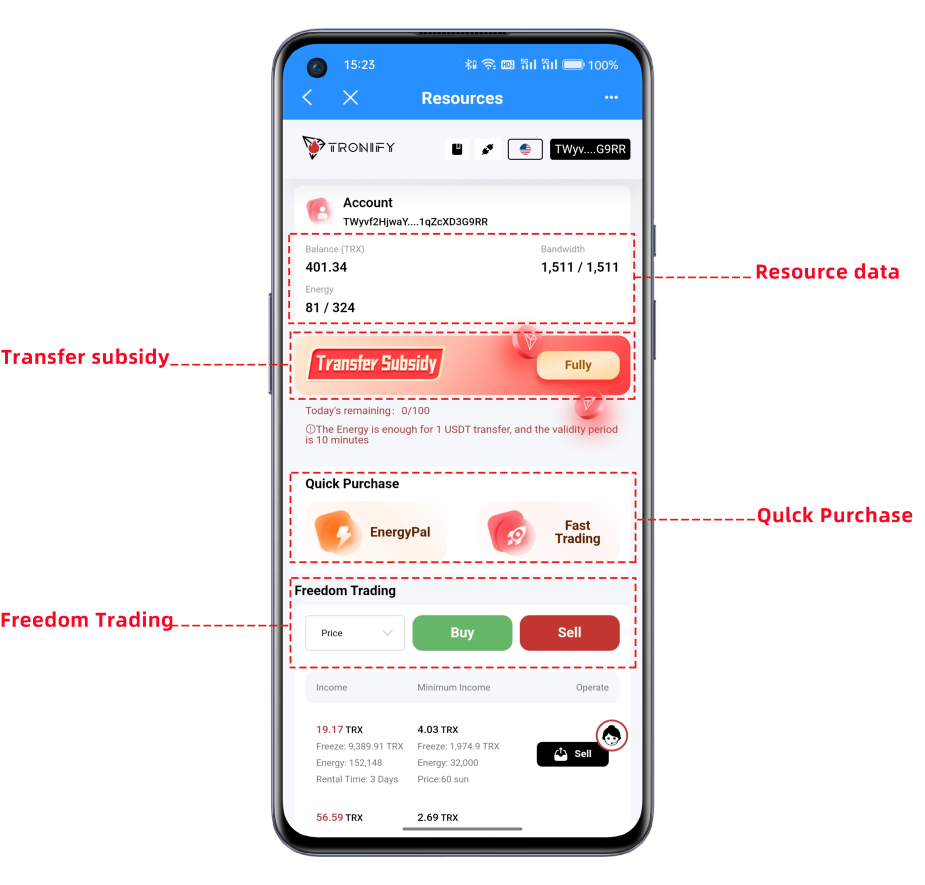
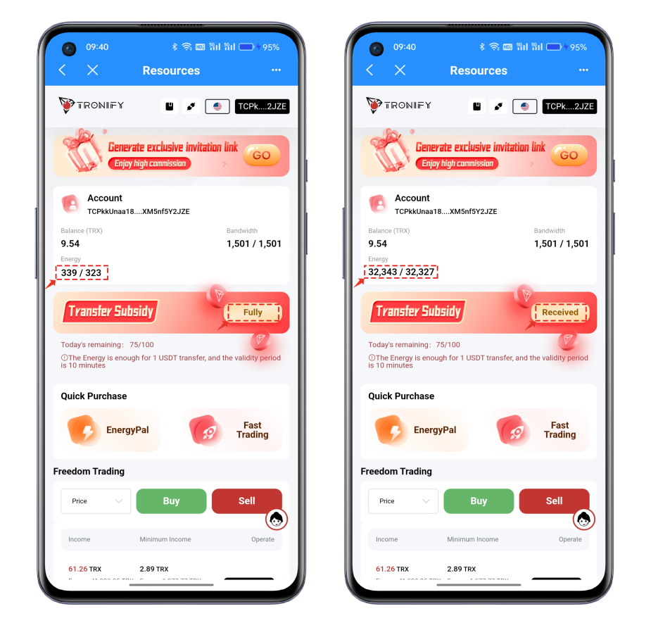
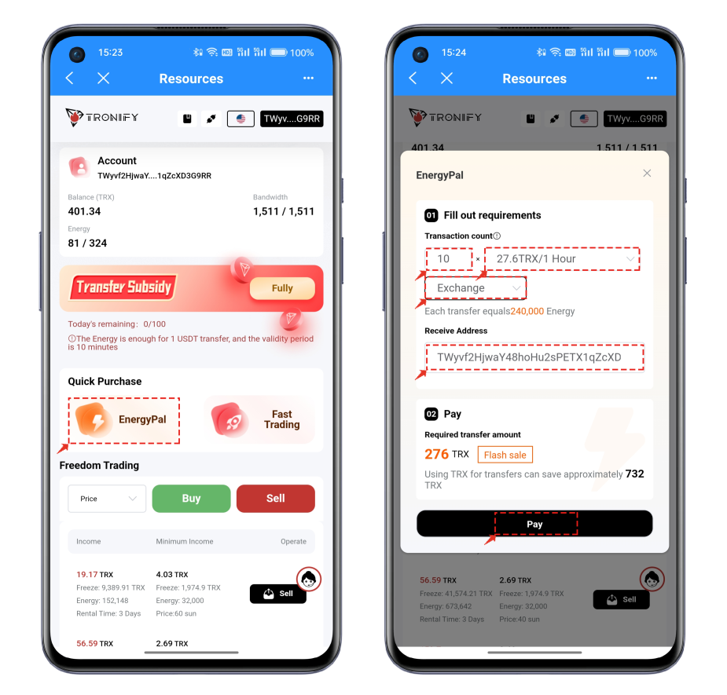
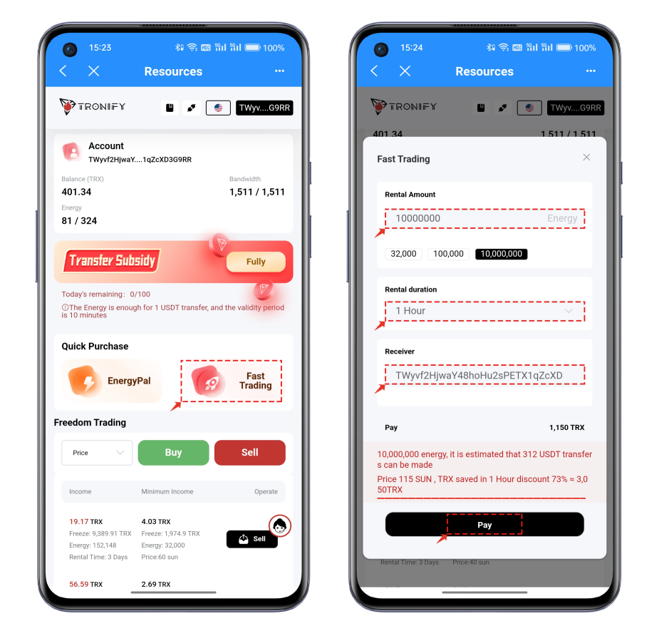
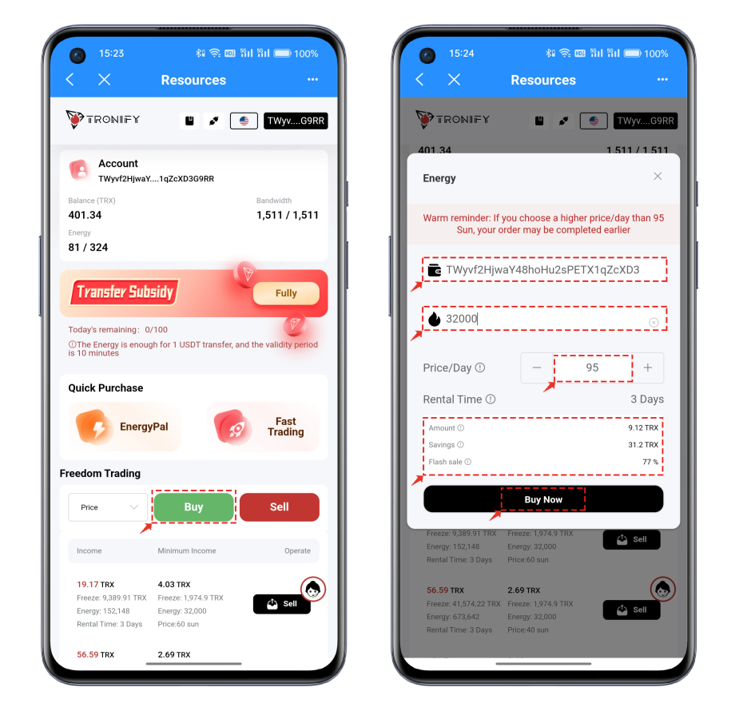
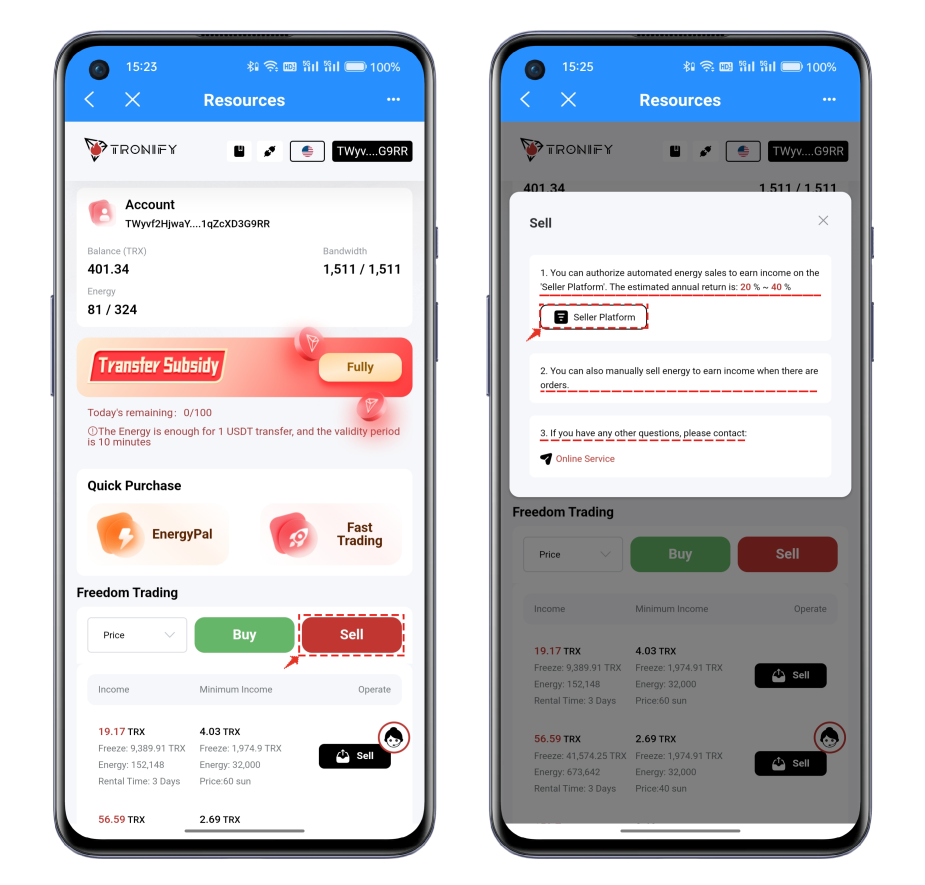
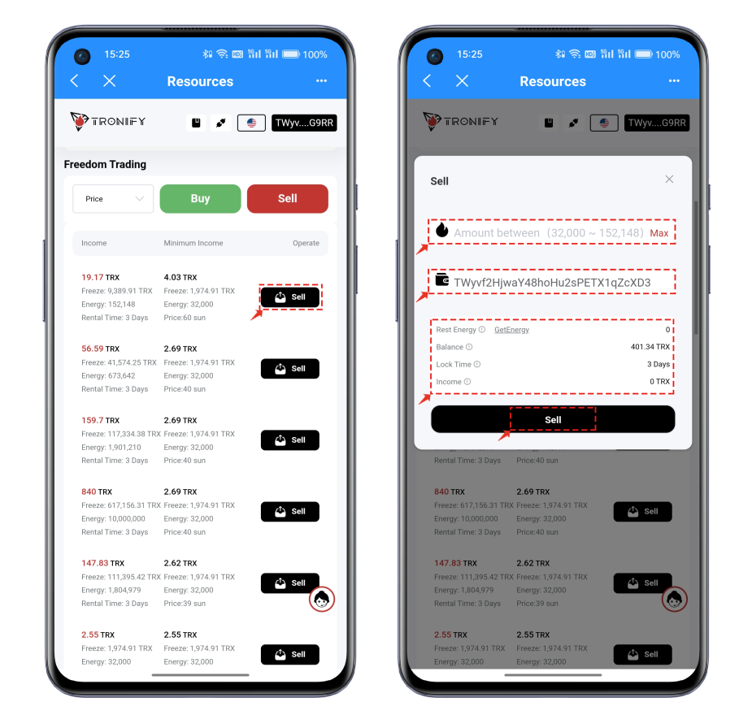
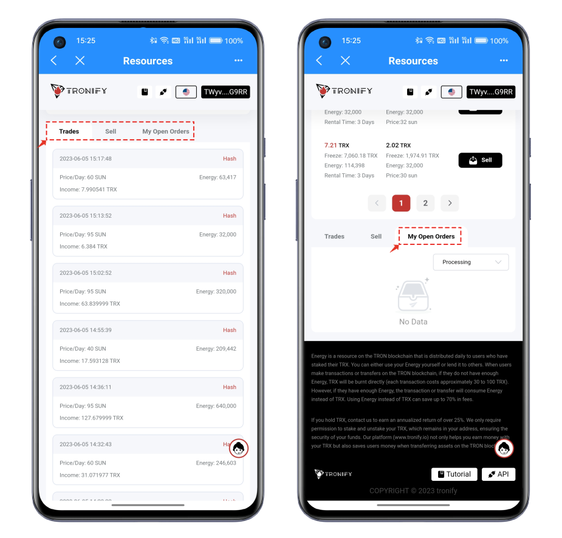

# TokenPocket Energy Rental Service

#### <mark style="color:orange;">About TRON Energy and Bandwidth:</mark> 

The Bandwidth and energy are the resource system used for processing and executing smart contracts and transactions. In the Tron network, each account has a certain amount of bandwidth and energy.

When an account sends a transaction or executes a smart contract, the corresponding bandwidth and energy will be consumed. The consumption of bandwidth and energy depends on the complexity and computational requirements of the transaction or smart contract. An account needs more bandwidth or energy to be able to send transactions or execute smart contracts once its bandwidth and energy are restored. (The TRON network can use resources or consume TRX to achieve the purpose of data on-chain.)

#### <mark style="color:orange;">How to get energy and bandwidth:</mark> 

Bandwidth and energy can be acquired and increased by holding and freezing TRX. Users can gain more bandwidth and energy by freezing TRX in their accounts, enabling them to perform more transactions and smart contract operations. Alternatively, users can utilize the rental market to pay for renting energy, which generally has lower overall costs than staking TRX energy tokens.

#### <mark style="color:orange;">How to use TokenPocket“Rent Energy”function:</mark> 

Even though TRON Stake 2.0, as a major upgrade to TRON, has made substantial improvements in many dimensions such as staking operations, resource management, asset unlocking waiting period, etc., the 14-day unlocking period is much longer than the 3-day period of Staking 1.0. Therefore, for some regular users, this seems to be less friendly, hence the demand for the energy leasing market becomes very important as it can save users more TRX consumption.

1\. Open TokenPocket, click on the 'Bandwidth/Energy' menu in the toolbar. The 'Bandwidth/Energy' interface includes various functions

<figure><figcaption></figcaption></figure>

2\. The resource leasing interface is mainly divided into four functional areas.

**Resource Data:** Here you can see the parameters of TRX balance and energy, bandwidth. Subsidy

**Benefits:** A hundred percent quota is available for free every day.

**Quick Lease:** You can customize various parameters such as transaction operations (transfer or contract interaction), usage time, number of uses, etc.

**Self-service Trading:** Normal buying and selling of energy, you can sell excess energy for profit.

<figure><figcaption></figcaption></figure>

3. Click on the 'Transfer Subsidy' button to receive enough energy for one USDT transfer. If not used, it will expire and be reclaimed after 10 minutes.

<figure><figcaption></figcaption></figure>

4. Quick Purchase includes 'EnergyPal’ and ‘Fast Trading’ functions. Click on 'EnergyPal’, and you can freely set the quantity, time, and operation content. The costs of different combinations will also vary. Rent energy according to your actual needs.

<figure><figcaption></figcaption></figure>

5. Click on 'Fast Trading' to set the amount of energy and time for renting, and then confirm the payment.

<figure><figcaption></figcaption></figure>

6. The Freedom Trading function includes 'Buy' and 'Sell'. Click on 'Buy', you can flexibly set the address to receive energy, the quantity of energy to rent, and the price setting. The default lease time here is 3 days. After setting, click on 'Place Buy Now'.

<figure><figcaption></figcaption></figure>

7\. Click on 'Sell'. Here is a selling prompt introduction. In the interface, you can see three options, among which the first and second options are to choose the method of confirming the sale of energy. Let's focus on the first method. You can view the specific operation method in the picture. It takes advantage of TRON's ability to set multiple signatures and gives this DApp's address an 'Active' authorization, but it is limited to the setting of the following six permissions. Configure permissions according to the options below.

* **TRX Stake 2.0:** This is the new version of the staking permission. After authorizing the platform, it will automatically stake for you to obtain resources.
* **TRX UnStake 1.0:** This is the unstaking permission. After authorization, the platform automatically unstakes the frozen orders of 1.0.
* **Resources Delegate:** This is the resource delegation permission. After authorizing the platform, it can automatically sell resources.
* **Resources Reclaims:** This is the cancellation of delegation permission. After authorization, the platform automatically recovers the expired delegated resources.
* **Voting:** Authorize the voting permission, and you can automatically vote after a successful sale to obtain TRX equity rewards.
* **Reward Withdraw:** This is the permission to receive benefits. After authorization, the platform will automatically receive the benefits to your wallet.

<figure><figcaption></figcaption></figure>

8. Click on the 'Sell' below the Freedom Trading. Here you can lease your energy to the platform and earn profits. Specific purchases, sales, and other orders can all be seen in the corresponding menus.

<figure><figcaption></figcaption></figure>

<figure><figcaption></figcaption></figure>
