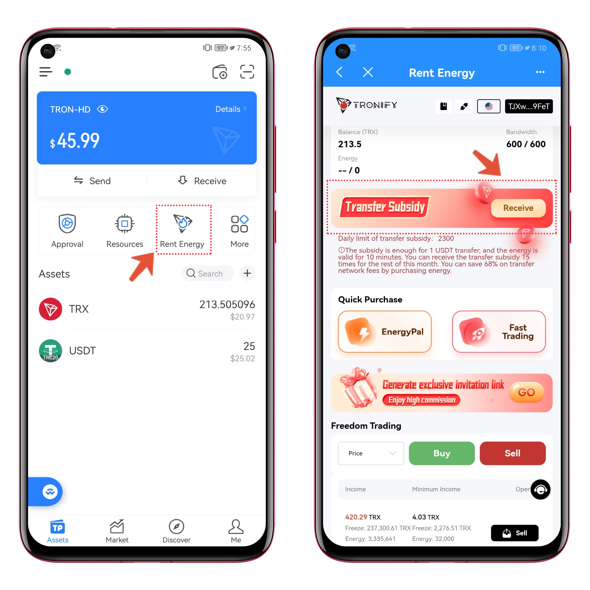

# How to transfer USDT to save gas

Transactions on the Bitcoin and Ethereum networks require the payment of a certain amount of Bitcoin (BTC) or Ether (ETH) as a gas fee.Transfers on TRON consume bandwidth and energy, and when energy and bandwidth are insufficient, TRX is burned. For most users, the gas deduction rates are often confusing during TRON transfer operations, and it may not be clear what options are available to minimize gas consumption.

In this article, TokenPocket will introduce you to the basics of TRON transfers and share methods to minimize gas fees for transferring USDT.

**Firstly, what is the TRON energy and bandwidth?**

Energy and Bandwidth Point of Tron is a resource system for processing and executing smart contracts and transactions.

* Energy: Energy represents the processor resources that are consumed during the running of a smart contract. Like bandwidth, it can be obtained by staking TRX, but no free energy is allocated to each account every day.
* Bandwidth: Primarily utilized for ordinary transactions such as transfers, staking, and unlocks. Each account is allocated 600 free bandwidth credits per day.

When transferring TRX, only bandwidth is consumed, not energy. Transferring a certain amount of TRX results in the burning of 268 bandwidth. On the other hand, transferring TRC20-USDT requires a fee of 13.74 TRX (\~ $1.23) or 27.6 TRX (\~$2.51). However, if you possess sufficient TRON energy and bandwidth, TRX won't be burned as a gas fee; instead, it will consume both bandwidth and energy. Each USDT transfer results in the burning of 345 bandwidth, and the energy burned varies depending on the TRON chain.

<figure><figcaption></figcaption></figure>

Based on the provided example, we can deduce the following points:

1. If the Payer possesses sufficient energy and bandwidth, the transfer process will consume energy and bandwidth as gas.
2. The quantity of energy and bandwidth consumed is closely linked to the availability of USDT in the recipient's account.

It is important to note that when transferring USDT, energy and bandwidth are primarily consumed. If the account lacks energy, TRX will be deducted as a transaction fee. Due to the blockchain's execution mechanism, the TRX fee will not be refunded if the transaction fails. To prevent this scenario, ensure that your account contains an adequate amount of TRX.

**Secondly, how to get Tron energy?**

Energy is not a free resource, therefore to get energy there are three ways you can get it as follows:

1. Get energy by freezing TRX:

1\) Download TokenPocket, please recognize TokenPocket official website:

[tokenpocket.pro](https://www.tokenpocket.pro/)

2\) Open TokenPocket, create or import【TRON Wallet】.

How to create or import【TRON Wallet】: &#x20;

[https://help.tokenpocket.pro/en/wallet-faq-en/tron-wallet/create](https://help.tokenpocket.pro/en/wallet-faq-en/tron-wallet/create)

3\) Click on【 Resources】on the home page of assets, click on【Staking Management】, you can choose【Frozen】an【Unfreeze】 according to your actual bandwidth/energy needs.

For more detailed tutorials, please read:

[https://help.tokenpocket.pro/en/wallet-faq-en/tron-wallet/tron2.0](https://help.tokenpocket.pro/en/wallet-faq-en/tron-wallet/tron2.0)\

<figure><figcaption></figcaption></figure>

2\. TokenPocket Tron Energy Rental

With TokenPocket, experience the energy leasing service with a single transfer of USDT for only 4.24 TRX. Save 68% (\~$0.86). For those interested, please refer directly to the third part of this article: TokenPocket Energy Rental Guide.

3\. Energy Subsidy: A tailor-made "Zero Gas" transfer campaign for TokenPocket users, offering a total of 2,300 transfers per day.

1\) Open TokenPocket, create or import a【TRON Wallet】.

How to create or import a 【TRON Wallet】:&#x20;

&#x20;[https://help.tokenpocket.pro/en/wallet-faq-en/tron-wallet/create](https://help.tokenpocket.pro/en/wallet-faq-en/tron-wallet/create)

2）Click【Rent Energy】to receive the transfer subsidy.\

<figure><figcaption></figcaption></figure>

The first option involves freezing a minimum of 1980 TRX (\~ $194.5) for 32890 Energy, which remains inaccessible for 14 days following the thawing process. No TRX is lost during the freezing period, and it allows the acquisition of voting rights. However, this approach demands a substantial amount of TRX for freezing.

In contrast, the second method, energy rental, is simpler and more direct, contributing to savings on TRX gas fees. Hence, leasing energy through energy platforms proves to be a more cost-effective choice.

Presently, the primary rental options in the market include the official TRON Energy Rental, TokenPocket Tron Energy Rental, and Telegram's Energy Rental Community.

<figure><figcaption></figcaption></figure>

**Thirdly, TokenPocket Energy Rental Guide.**

Tip: TokenPocket Tron Energy rental  service is customized for TokenPocket users, so you need to download the TokenPocket mobile application.

1. To download TokenPocket, please visit the official website of TokenPocket:

&#x20;       [tokenpocket.pro](https://www.tokenpocket.pro/)

2. To create a TRON Wallet.

Open TokenPocket and click on the icon【】in the upper right corner of the screen. select【TRON】 from the list and create a new wallet. If you already have a TRON wallet, please click on【Import Wallet】.

<figure><figcaption></figcaption></figure>

3\. To get Energy&#x20;

The 1st entry :&#x20;

1. Click on 【Rent Energy】, which includes the functions of both【EnergyPay】and 【Fast Trading】.
2. Click on 【EnergyPay】, you can freely adjust the number of orders. Similarly, under【Fast Trading】, you can freely set the quantity of energy to rent and the rental duration according to your specific requirements.

<figure><figcaption></figcaption></figure>

The 2nd entry :

1）Click on【Send】

<figure><figcaption></figcaption></figure>

2）Click on【Subsidy】， then click 【EnergyPay】or【Fast Trading】 to purchase energy.

<figure><figcaption></figcaption></figure>

Using【EnergyPay】or【Fast Trading】to offset a transfer with rented energy is illustrated through the following methods:

Method 1: Click【EnergyPay】 and set the number of transfers to【1】. The payment amount is 4.24 TRX, resulting in savings of approximately 9.2 TRX.

Method 2: Click【Fast Trading】 and enter the rental amount【32000】. The rental time can be【1 hour】. The payment amount is 4.24 TRX, resulting in savings of approximately 9.2 TRX.

<figure><figcaption></figcaption></figure>

Aside from the aforementioned methods to access the energy rental service, you can also utilize the service by entering【 Tron  Energy Rental】 in【Discover】on the mobile terminal TokenPocket or scanning the QR code.

Method 1: Start by clicking on【 Discover】at the bottom of the screen and then type【 Tron Energy Rental】into the search bar.

<figure><figcaption></figcaption></figure>

Method 2: Begin by clicking on【 Discover】 at the bottom of the screen, followed by selecting the function to scan the QR code in the upper right corner of the screen. Scan the QR code of【 Tron Energy Rental】 displayed in the image below to avail the rental service and minimize transfer gas fees.

<figure><figcaption></figcaption></figure>

Using TokenPocket Tron Energy Rental can significantly reduce fees. A single USDT transfer only necessitates 4.24 TRX, resulting in a 68% saving (\~ $0.86), while ensuring the security and convenience of the transfer process. Additionally, TokenPocket provides "zero-fee" transfer activities for TokenPocket users, limited to 2300 users daily on a first-come, first-served basis.

* For downloads, please visit the official TokenPocket website:  [tokenpocket.pro](https://www.tokenpocket.pro/)
* Twitter:

&#x20;      [https://twitter.com/TokenPocket\_TP](https://twitter.com/TokenPocket\_TP)

&#x20;      [https://twitter.com/TP\_NewsHub](https://twitter.com/TP\_NewsHub)

* TokenPocket English community: [https://t.me/tokenpocket\_channel](https://t.me/tokenpocket\_channel)

\
