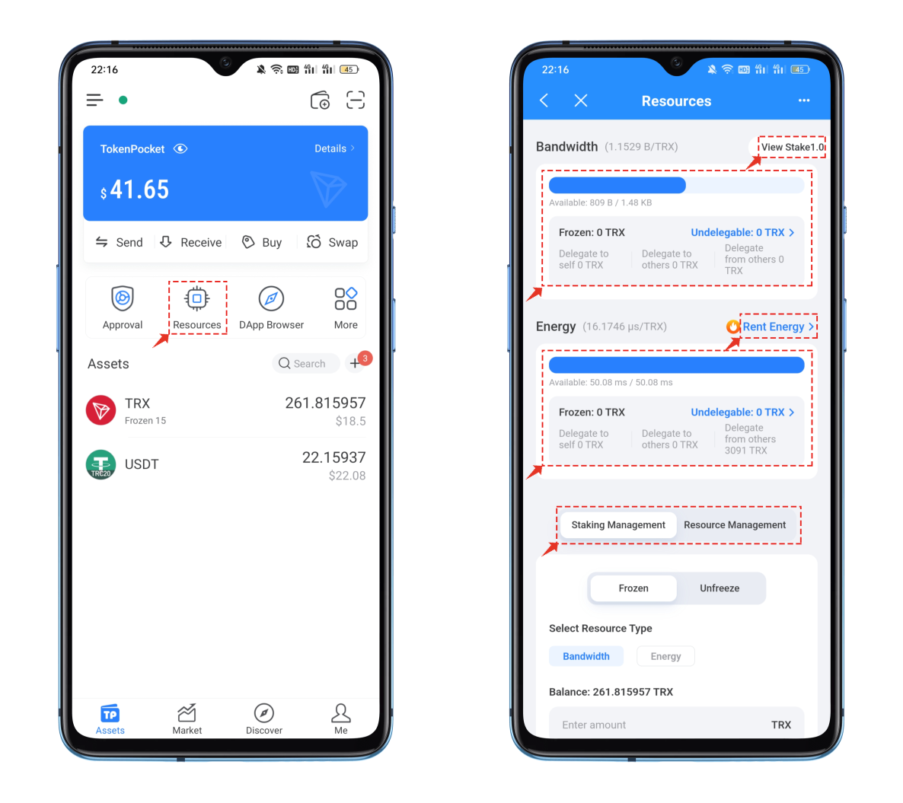
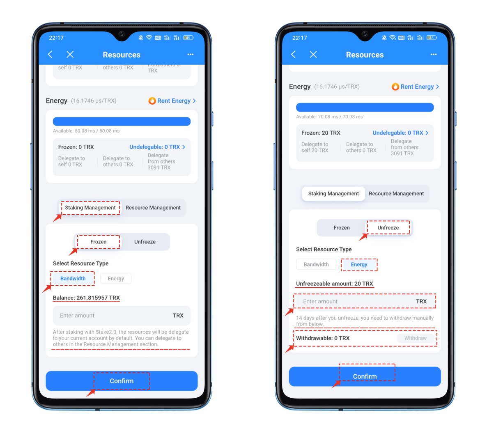
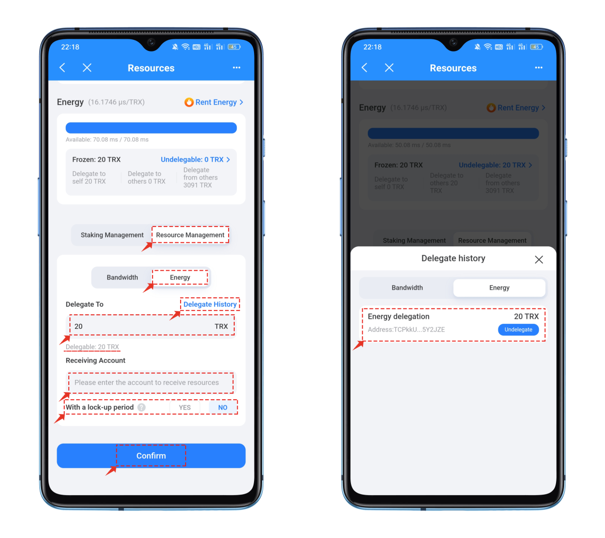

# How to Use TRON Staking 2.0

### <mark style="color:orange;">What are wave field energy and bandwidth:</mark> 

Wave field (Tron) energy bandwidth is a resource system used for processing and executing smart contracts and transactions. In the Tron network, each account has a certain amount of bandwidth and energy.\
When an account sends a transaction or executes a smart contract, the corresponding bandwidth and energy will be consumed. The consumption of bandwidth and energy depends on the complexity and computational requirements of the transaction or smart contract. An account needs more bandwidth or energy to be able to send transactions or execute smart contracts once its bandwidth and energy are restored. (The Tron network can use resources or consume Trx to achieve the purpose of data on-chain.)

### <mark style="color:orange;">How to obtain energy and bandwidth:</mark> 

Bandwidth and energy can be acquired and increased by holding and freezing TRX tokens. Users can gain more bandwidth and energy by freezing TRX tokens in their accounts, enabling them to perform more transactions and smart contract operations. Alternatively, users can utilize the leasing market to pay for fixed energy, which generally has lower overall costs than staking TRX energy tokens.

### <mark style="color:orange;">Usage of Staking 2.0:</mark> 

1\. Open TokenPocket and click on the “Bandwidth/Energy” menu in the toolbar, which contains various functions in the Bandwidth/Energy interface.\
**View Stake 1.0**: Used to view the staking data in Stake 1.0, such as retrieving staked TRX.\
**Bandwidth Data**: View the amount of bandwidth, including data on the delegation to others, others’ delegation, and unlockable delegation.\
**Energy Data**: View the amount of energy held, including data on the delegation to others, others’ delegation, and unlockable delegation.\
**Stake/Resource Management Menu**: Used to perform all operations related to Stake 2.0.\

<figure><figcaption></figcaption></figure>

2\. Click on “Staking Management” to choose between “Freeze” and “Unfreeze” based on your actual bandwidth/energy needs.

**Freeze operation:** Based on the TRX balance in your current wallet, enter the amount you wish to stake in the quantity field to obtain resources. These assets can be delegated for others to use.

**Unfreeze operation:** If the frozen resources have not been used for other operations or if you have reclaimed the staked assets delegated to others, you can see the amount available for unfreezing on the interface. Enter the quantity you wish to unfreeze in the quantity field and execute the operation. _**It will take 14 days for the assets to return to your wallet.**_ Once the time period has expired, you can perform a withdrawal operation in the “Withdrawable” section, and only then will the TRX be returned to your wallet address.

<figure><figcaption></figcaption></figure>

3\. Resource management primarily involves executing delegated tasks and retrieving delegated tasks. Enter the amount to be delegated in the “Resource Management” column and set the “Receiving Address.” The selection of the “With a Lock-up Period” is crucial here. If you choose “Yes,” the usage time for these resources will be strictly limited to 3 days after execution. If you choose “No,” you can retrieve the delegated tasks immediately after execution, as shown in the image on the right.

<figure><figcaption></figcaption></figure>
