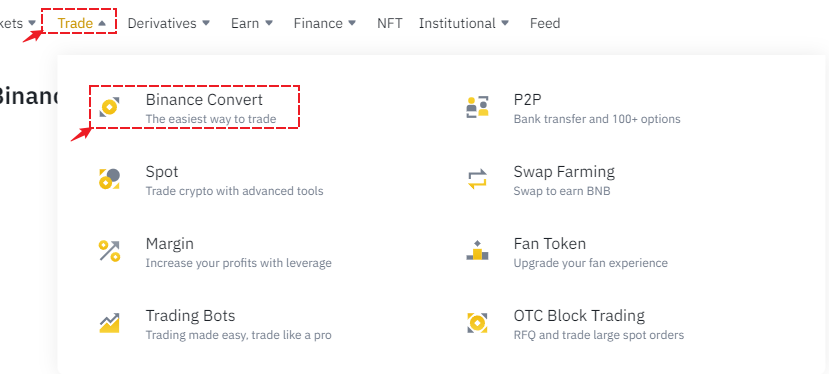
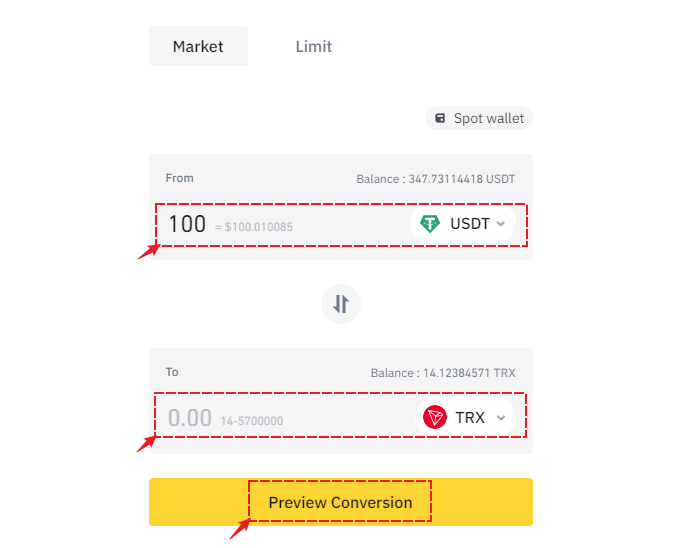
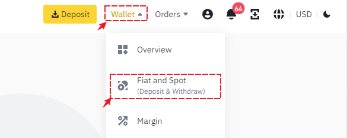
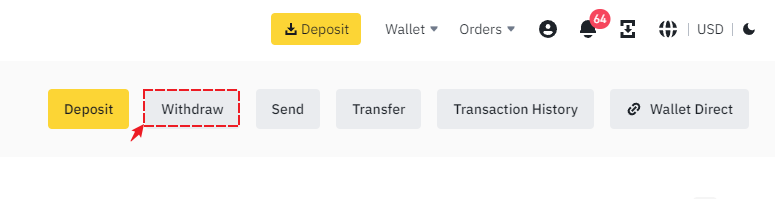
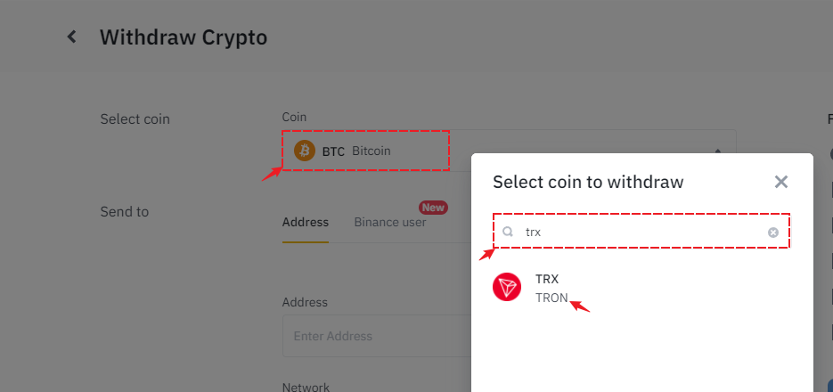
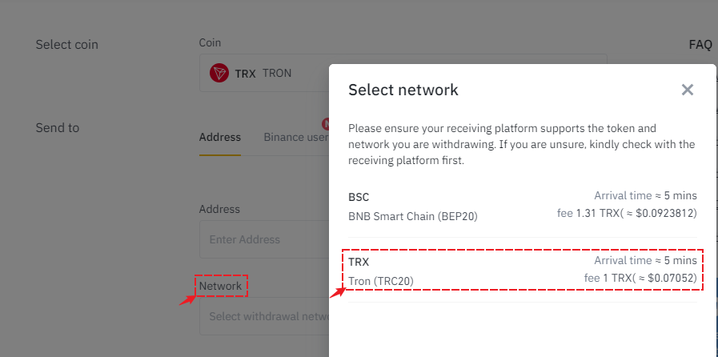
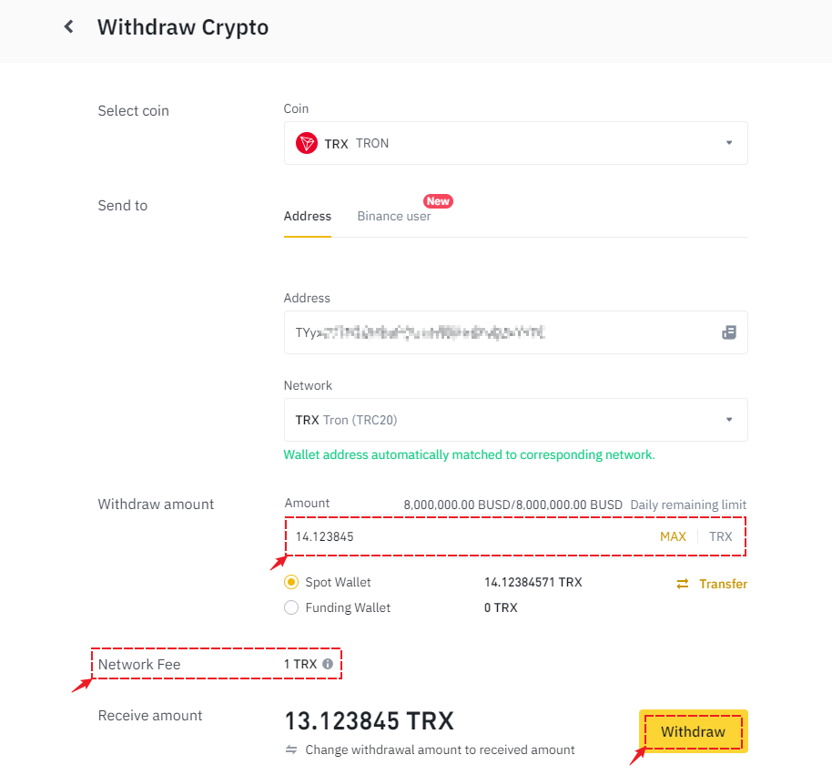

# How to acquire TRX tokens.

Any on-chain operation performed on the TRON (TRX) network requires the payment of miner fees (Gas), which is why TRX is an essential token to use in the TRON (TRX) wallet. (TRON also has a gas payment method based on resource consumption, but we won't discuss it further here.)

### <mark style="color:orange;">**To exchange through Transit Swap**</mark>

Open TokenPocket and tap on the top right corner 【Swap】 button.

<figure><figcaption></figcaption></figure>

In the open interface, set the token (e.g., USDT) that needs to be exchanged, select the token TRX to be exchanged into, and then select an Ethereum wallet as the receiving address. Please do not use an exchange address as the receiving address.&#x20;

When exchanging tokens for the first time, other than the mainnet coin, an authorization operation is required here. The authorization quantity can be set reasonably. After completing the authorization, proceed with the exchange by specifying the token to be exchanged, the token to be received, the quantity, setting the receiving address, and clicking \[Confirm Exchange] to sign and obtain TRX tokens. (Transit supports both on-chain and cross-chain exchange services.)

<figure><figcaption></figcaption></figure>

### <mark style="color:orange;">Purchase TRX tokens through Binance.</mark>

Open Binance, click on "Trade," and select "Binance Convert."

<figure><figcaption></figcaption></figure>

Use Binance Convert to quickly obtain TRX tokens using other cryptocurrencies.

<figure><figcaption></figcaption></figure>

### <mark style="color:orange;">Transfer TRX to wallet</mark>

Click on "Wallet" and select "Fiat and Spot."

<figure><figcaption></figcaption></figure>

Select "Withdraw" to withdraw assets.

<figure><figcaption></figcaption></figure>

Search and select the TRX token from the token list.

<figure><figcaption></figcaption></figure>

Choose the TRC20 network from the network list.

<figure><figcaption></figcaption></figure>

Set the receiving address and the amount of TRX to be withdrawn. The transaction fee is only 1 TRX. Click "withdraw" and verify to extract the tokens to your wallet. (Please make sure to double-check the receiving address, you can open the TRON wallet in TokenPocket, click on "receive" and copy it.)

<figure><figcaption></figcaption></figure>
