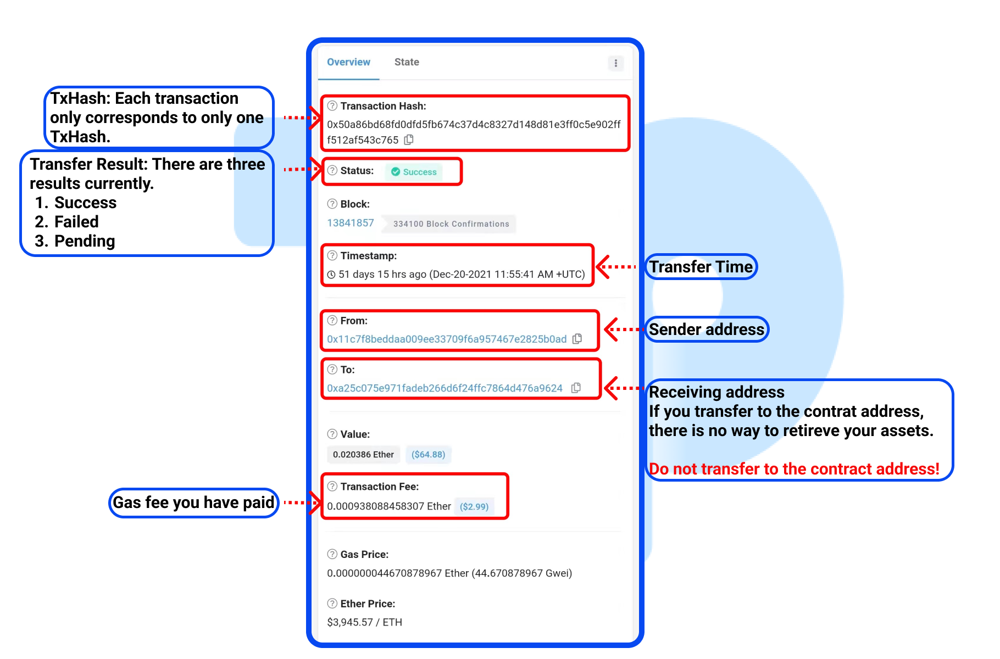

# Query transfer records on  ETH explorer.

1. Open TokenPocket APP, click the token you need to query in the page of \[Assets], and enter to the page of \[Transfer Detail]. Click the record you want to query and you can see the details about this transfer. Click the ETH Explorer image under this page and then enter the  ETH Explorer.&#x20;

.png>)

2\. You can query the transaction status, sender address, receiving address, contract address of this token, the gas fee, etc. on this page.

