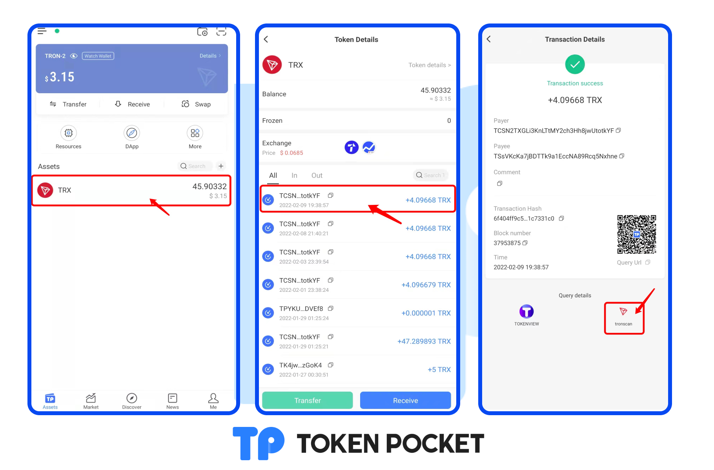
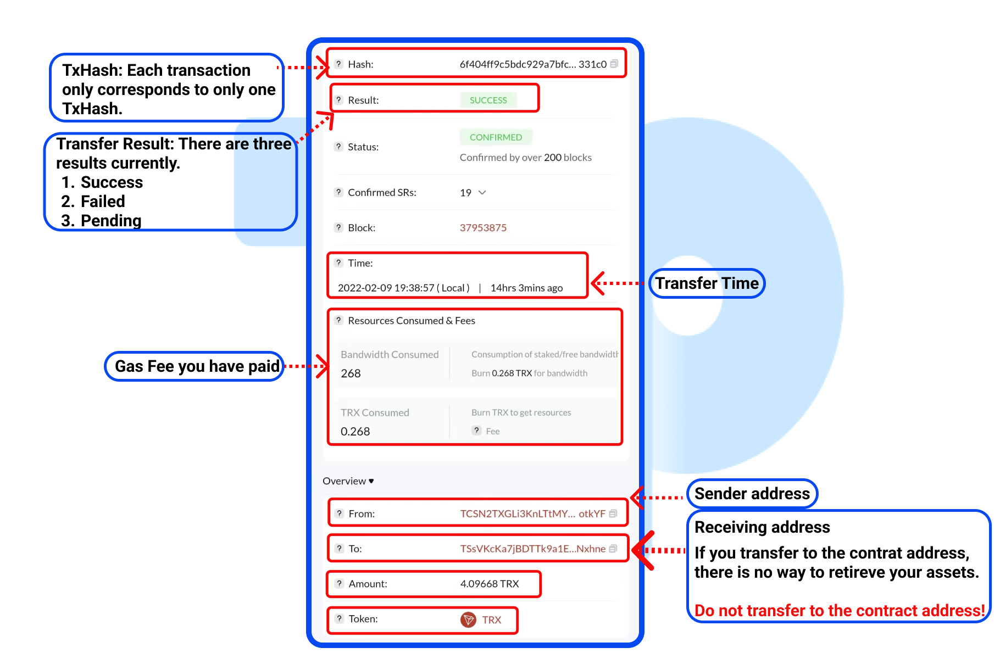

# Query transfer records on TRON explorer.

1. Open TokenPocket APP, click the token you need to query in the page of \[Assets], and enter to the transfer records page. Click the record you want to query and you can see the details about this transfer. Click the TRON Explorer image under this page and then enter the TRON Explorer.&#x20;

2\. You can query the transaction result, sender address, receiving address, contract address f this token, the gas fee, etc. on this page.

