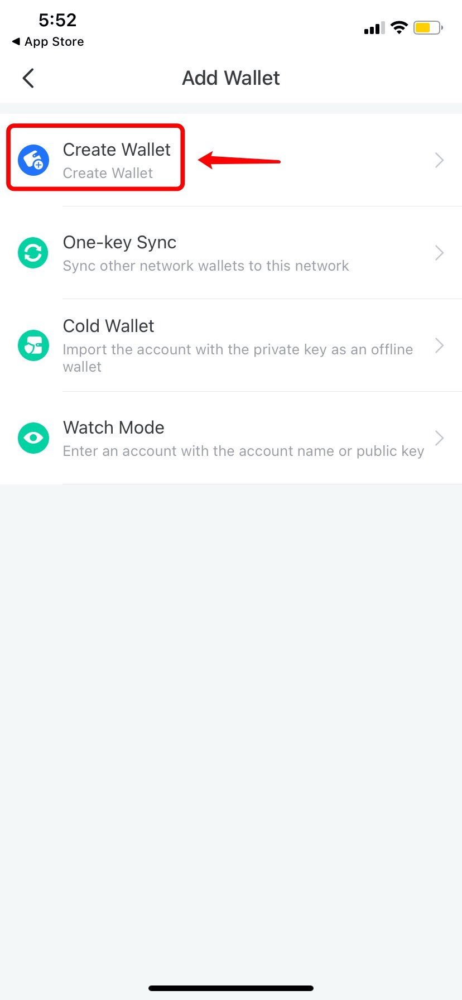
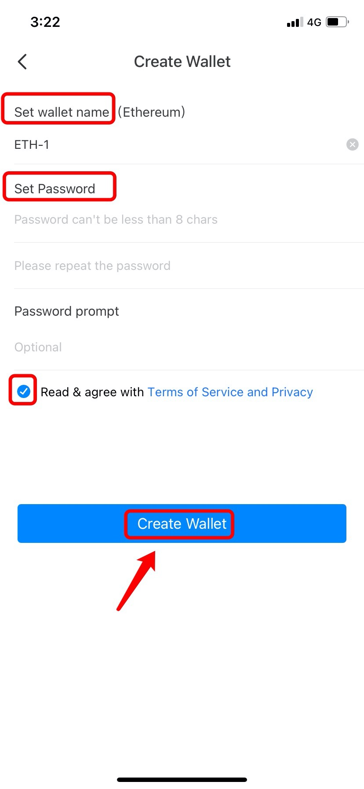
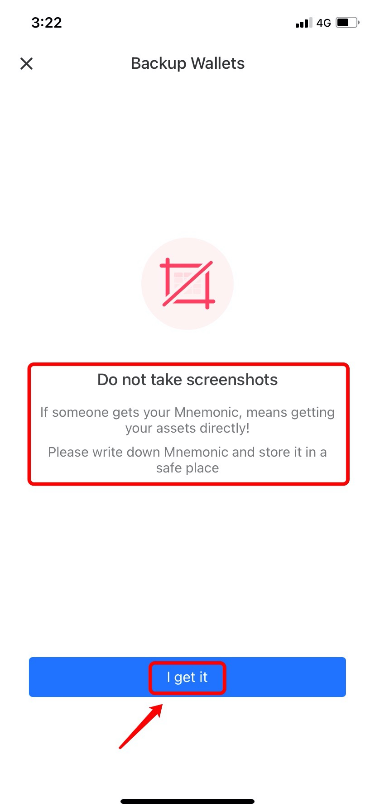
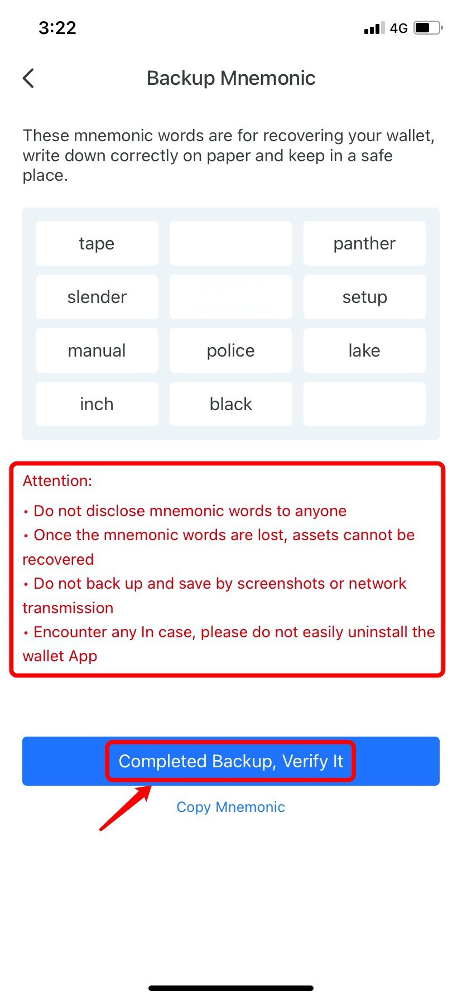
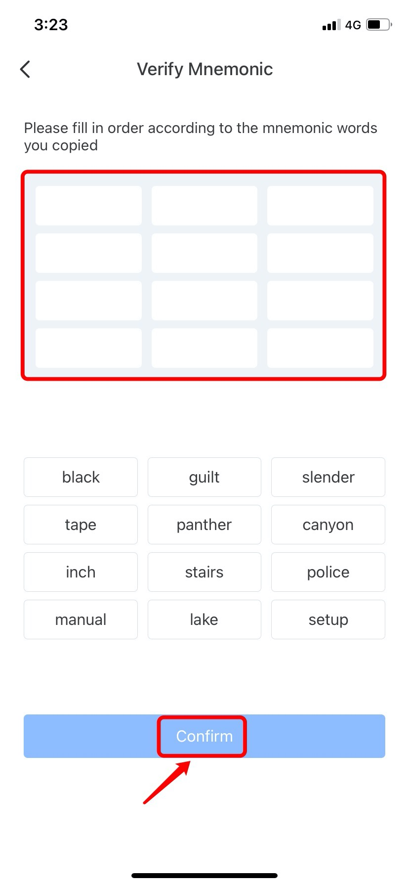

# How to Create a Wallet?

1.Open TokenPocket App, click on \[No wallet];

.png>)

2\. Choose the blockchain network you would like to create; (Take Ethereum Network as an example here)

.png>)

3\. Click on \[Create Wallet];

4\. Set your wallet name and password, and then tick \[Terms of Service and Privacy], click \[Create Wallet] to procceed;

5\. Enter the \[Backup Mnemonic] page, and please do not take screenshots here for your assets safe, and then click \[I get it];

6\. Backup your mnemonic and keep it in a safe place, read \[Attention] carefully, click \[Completed Backup, Verify it];

7\. Fill in mnemonic words in order according to the words you copied, and then click \[Confirm];

8\. After that, you've created a wallet successfully!

.png>)

