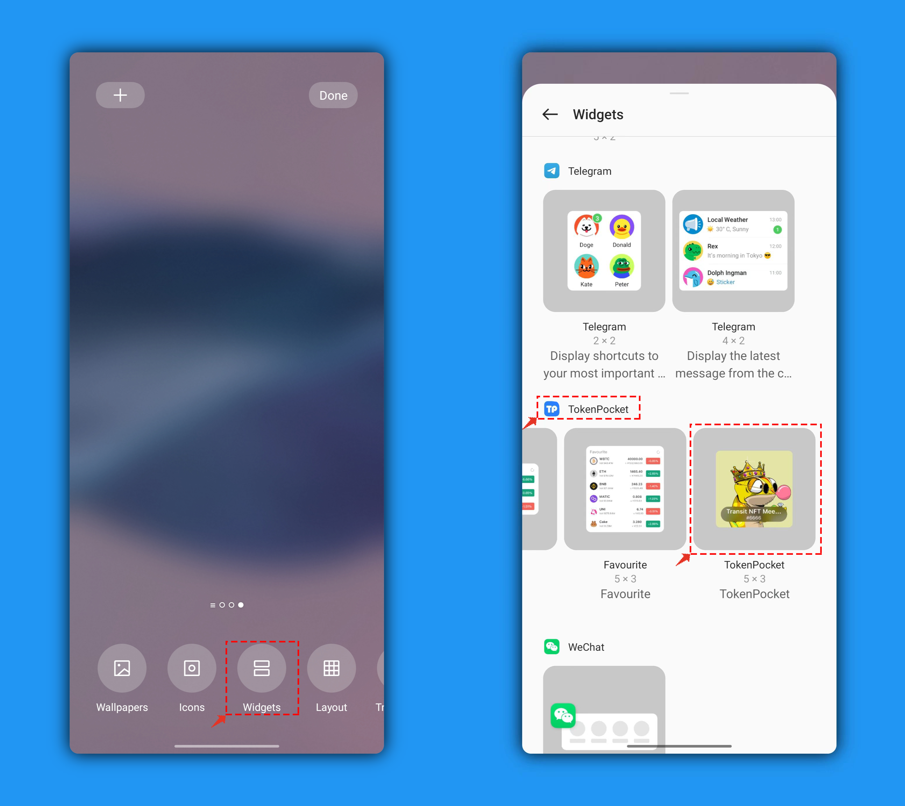
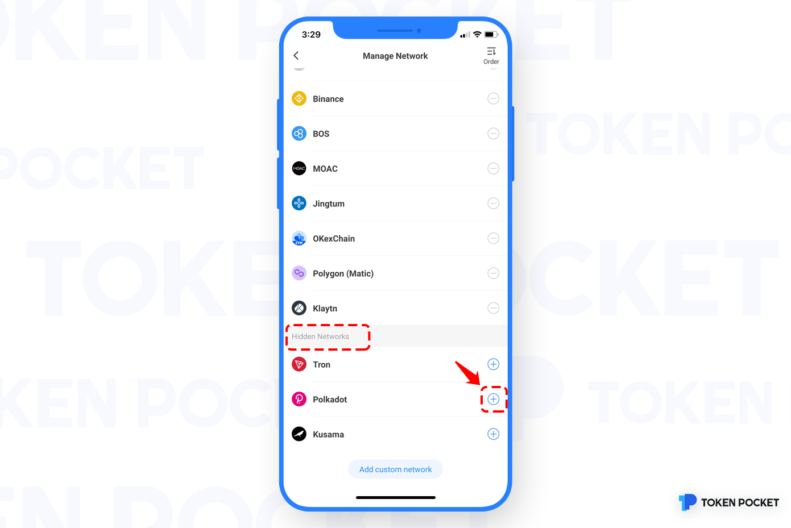

# How to hide the Wallet?

1. Open TokenPocket App, click on the wallet name on the upper left corner of the \[Asset\] page;

2. Click the wallet pattern on the upper left;

3. Enter the page of \[Manage Wallets\], click the pattern on the lower left;

4. Click \[Manage Network\];

5. Choose a wallet, click \[—\] on the right, then you can hide the Wallet ;

**Attention**: If the current network contains a no-deleted wallet, it cannot be hidden.

6. The hidden wallet can be found on \[Hidden Network\] at the bottom of this page, click \[+\] on the right, then you can unhide the Wallet.

