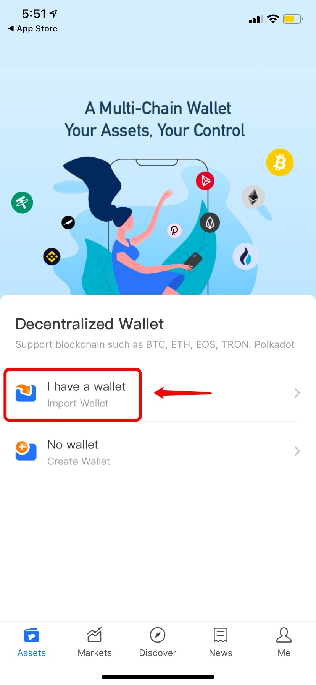
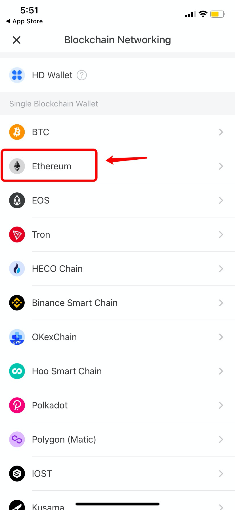
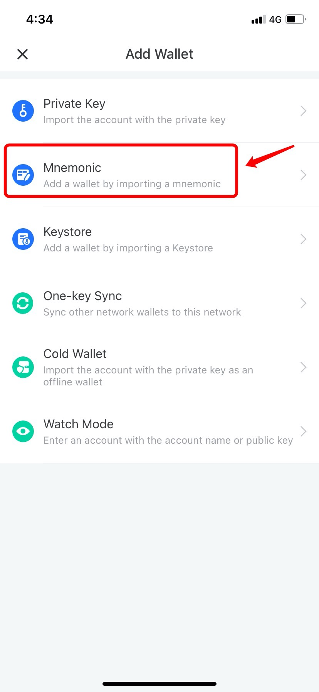
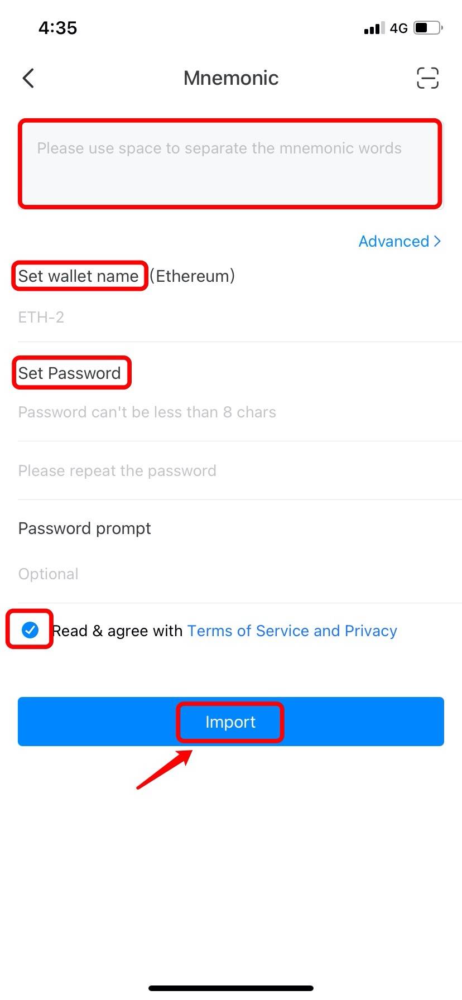

# How to Import a Wallet?

1.Open TokenPocket App, click on \[No wallet];

2\. Choose the blockchain network you would like to import; (Take Ethereum Network as an example here)

3\. Choose a way to import a wallet; (Take mnemonic method as an example)

4\. Fill in mnemonic, set wallet name and password, tick \[Terms of Service and Privacy], and click \[Import] to complete importing your wallet.

