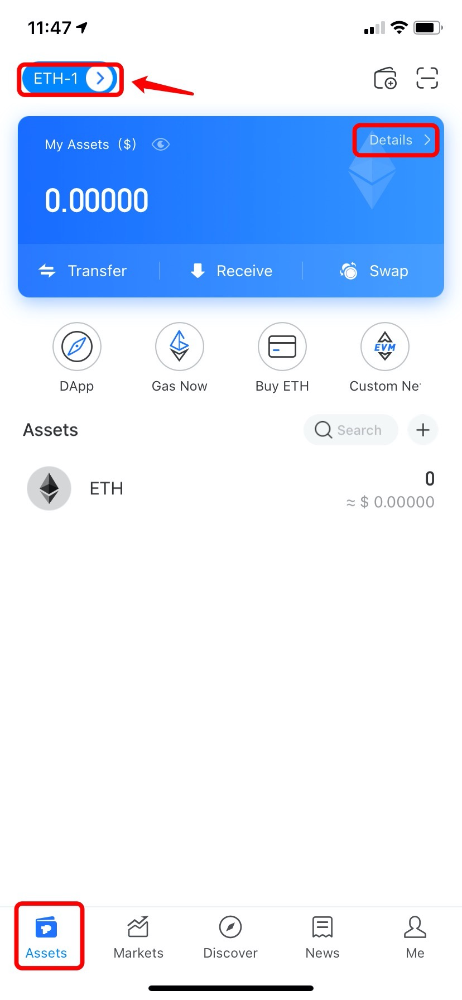
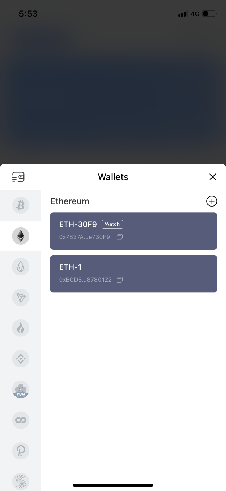
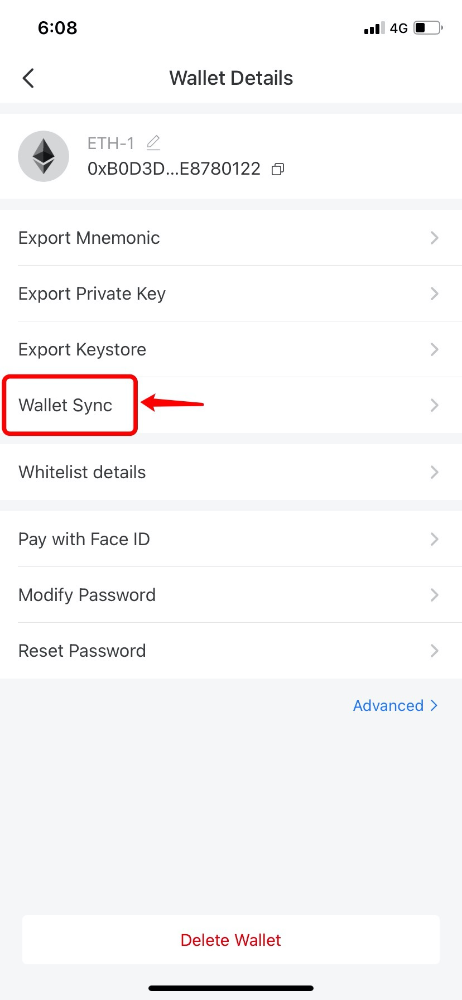

# How to Use Wallet Sync Function?

"**Wallet Sync"** is designed to help users quickly synchronize wallets on this network to other networks. When you transferred assets by the wrong network protocol \(chain\), this function can get your assets back. 

For example, if you've transferred USDT to Ethereum wallet address by HECO chain, you won't receive your USDT in Ethereum wallet. In this case, your USDT will be in HECO chain, so, what you need to do is syncing HECO network, which means that a receiving address of heco network will be generated in your other wallets, and then your assets can be found. \(If the token was still not shown on your wallet, please add the token manually\)

**Steps:**  
1.Open TokenPocket App, click on the wallet name in the upper left corner of the \[Asset\] page. If your wallet is HD wallet, you need to click \[Details\]; \(Take syncing ETH network wallet to another network as an example\)

2. Select a wallet to generate receiving address, and no matter which wallet it is;

2. After entering the \[Wallet Details\] page, click \[Wallet Sync\];

3. Select a network that you need to sync and then click \[Start syncing\], and then go back to the selected wallet, your will find your assets back. 

**Please refer to** [**Here**](https://tp-lab.tokenpocket.pro/AssetsFind/index.html?locale=en#/) **for finding back your funds.**

