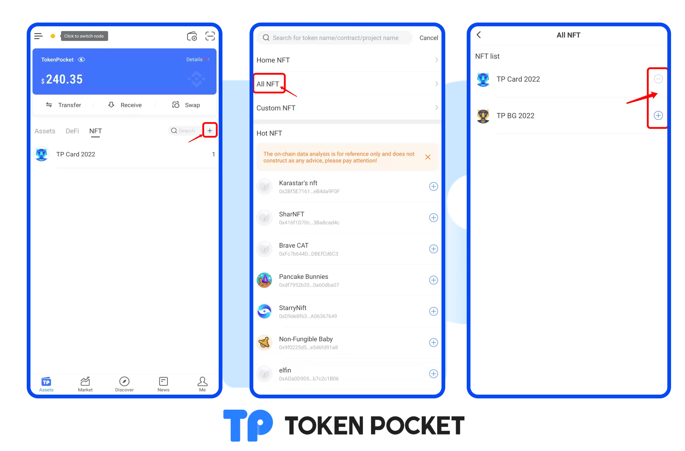

# How to manage My NFT assets?

**The first way**: Select the <mark style="color:orange;">**\[NFT]**</mark> section on the Assets page and click **\[+]**. Click <mark style="color:orange;">**\[All NFT]**</mark> to enter the management page. You can click **\[-]** to hide the NFT and click **\[+]** to show the NFT.&#x20;

**The second way:** Select the <mark style="color:orange;">**\[NFT]**</mark> section on the Assets page and select the NFT you want to hide, swipe to the right, and click **\[Delete]**.

.png>)
