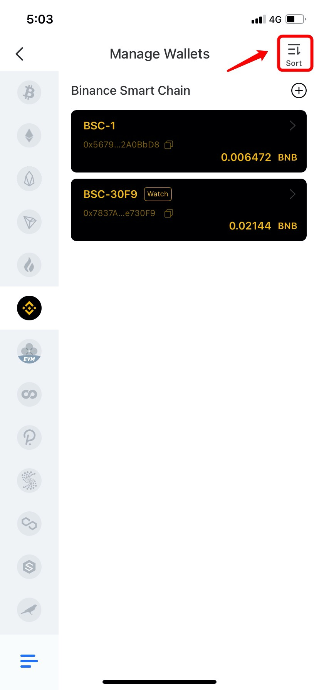
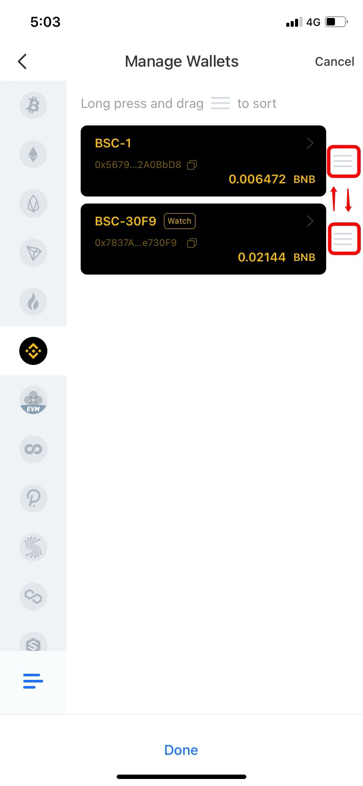
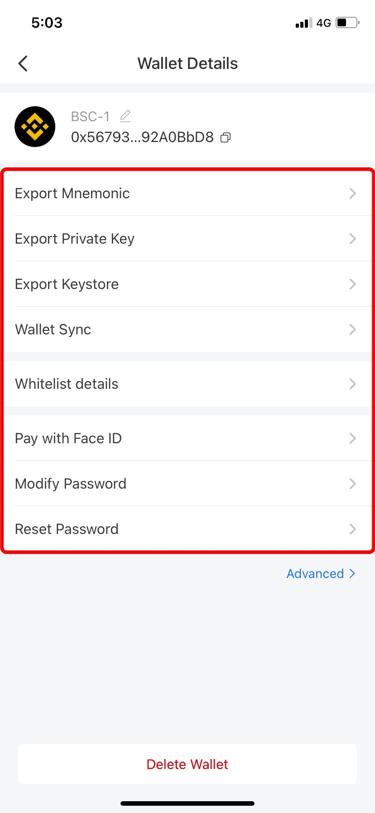

# How to Manage My Wallet?

1.Open TokenPocket App, click on \[Me], and then click \[Manage Wallets];

.png>)

2\. Click \[Sort] button in the upper right corner to sort multiple wallets;

3\. Long press and drag to sort wallets;

4\. After sorting, click \[Cancel] to excit. And then choose and click a wallet you need to manage to enter the \[Wallet Details]. In this page, you can export the mnemonic/private key/keystore, modify or reset password, etc.&#x20;

**Attention**: If you need to delete your wallet, please make sure that you've already backed up your mnemonic/private key, otherwise, your assets will be lost.

****\
****

****\
****
