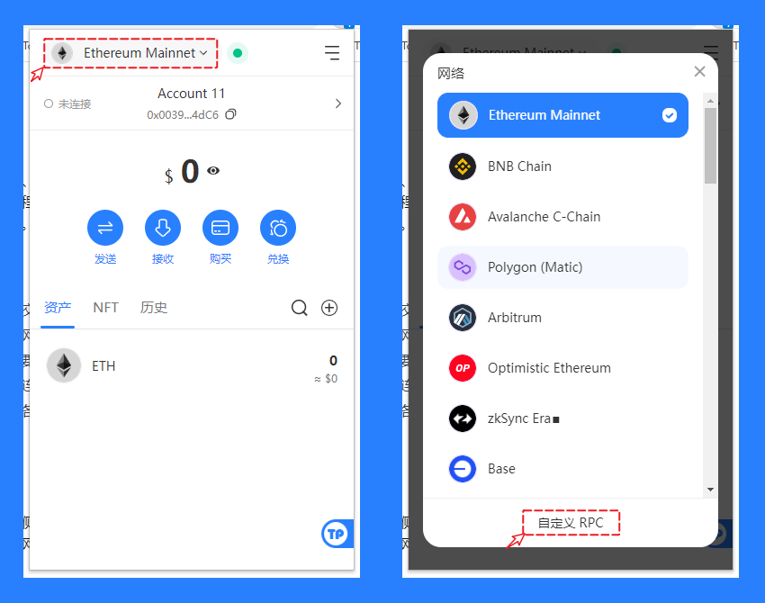

# What is a custom network

With the development of the blockchain ecosystem, building another blockchain or network compatible with Ethereum and allowing users to execute on-chain interactions between these networks has become an effective solution. This approach not only provides greater flexibility to meet specific application requirements but also enhances the overall interoperability of the entire blockchain ecosystem. With the momentum of this trend, an increasing number of projects are choosing to build customized blockchain networks on top of Ethereum to meet the growing demands of the blockchain and cryptocurrency markets.

In this process, users need to use a series of key information, including network name, RPC address, chain ID, currency symbol, etc. These details are usually provided by the project team or developers. By customizing the network, users can integrate non-mainstream or emerging blockchain projects into their wallets, perform transactions, check balances, and undertake other operations, enabling a broader range of options for digital asset management.

### <mark style="color:orange;">Adding Custom Networks</mark>

#### **Mobile:**&#x20;

Open TokenPocket on your mobile device, tap the first icon in the upper right corner to add a wallet. Scroll down to the bottom of the network selection interface and enter the custom network entrance. (You can also directly search for the required custom network data in the search bar.)

<figure><figcaption></figcaption></figure>

#### Plugin side:

&#x20;Open the TokenPocket plugin wallet, click on the top network selection menu, and then choose "Custom RPC."

<figure><figcaption></figcaption></figure>

### <mark style="color:orange;">Custom Network Risk Prevention</mark>

1. Project Risks&#x20;

Custom networks added by users may originate from emerging or non-mainstream blockchain projects. These projects might have technical flaws, market risks, or other potential issues that could result in asset loss or price volatility. Therefore, when selecting custom networks, caution is advised, and it is essential to choose those that have been thoroughly validated and are secure and reliable. Not all networks (public chains) possess the same level of security.

2. Privacy Risks

When using a custom network, user transaction information may be exposed to third parties through RPC interfaces, potentially leading to privacy breaches. This is especially critical when the RPC interfaces of custom networks are provided by untrusted sources. To ensure privacy security, users are advised to carefully consider the source of RPC interfaces and avoid using interfaces provided by untrusted parties.

Simultaneously, users should ensure the accuracy and correctness of information related to custom networks. To facilitate this, users can search for networks on [https://chainlist.tptool.pro/](https://chainlist.tptool.pro/) to automatically add them to TokenPocket.

3. Transfer Risks

Avoid transferring tokens between different networks, as transfers between different networks may result in tokens not being credited, even though custom networks may be compatible with Ethereum. However, they differ from the Ethereum mainnet. Addresses, private keys, and mnemonic phrases can be the same across different EVM-compatible chains. Therefore, if a transfer error occurs between different networks, retrieval can be done using the private key or mnemonic phrase.

4. Risks of Use

Understanding the operation mechanism within a custom network (public chain) is crucial. When engaging in interactions, it is necessary to utilize the native tokens on the mainnet of this public chain. In other words, when executing transactions, contract interactions, or other operations, ensure that you possess a sufficient amount of the mainnet tokens of this public chain to cover associated fees. The use of these mainnet tokens is essential to ensuring the smooth execution of various operations on the custom network. Therefore, prior to any interaction with this public chain, it is vital to be aware and confirm that your account holds an adequate amount of mainnet tokens.

5. Legal and Regulatory Risks

In certain countries and regions, the use of custom networks may be subject to legal and regulatory restrictions. Users must ensure compliance with local laws and regulations to avoid potential legal risks.
