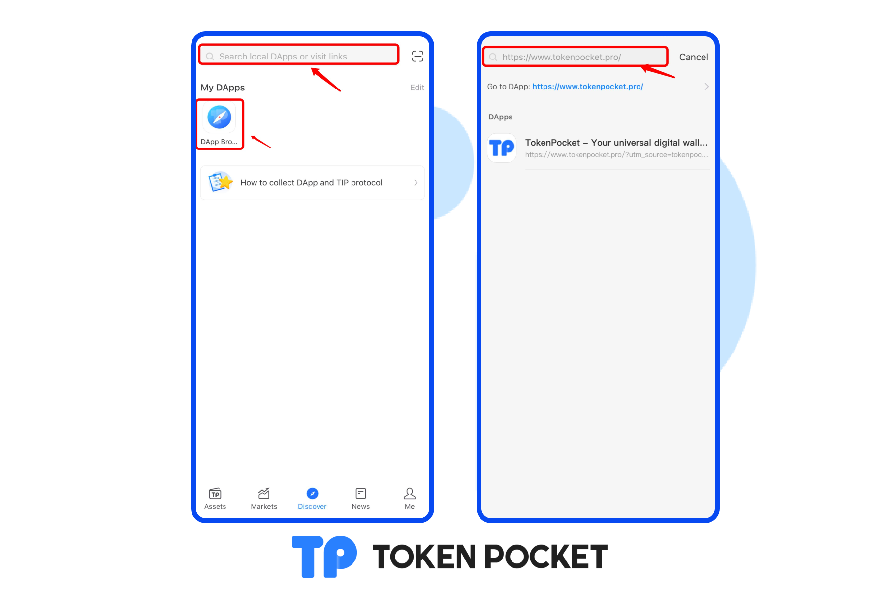
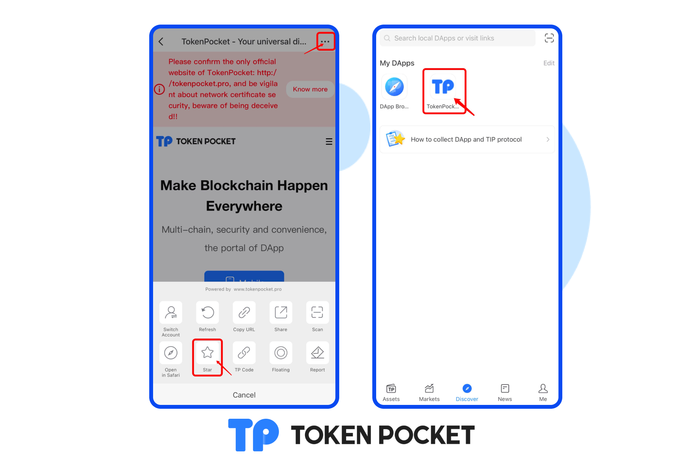

# How to collect DAPP and TIP-001 protocol?

The new version of the wallet has a major revision in the “Discovery”, and some new features have been added at the same time. Users can use it according to their own habits; they can also classify the DApps that are commonly used in daily life and favorite into a folder. It is very similar to the mobile phone system for easy management and viewing. Let's give a functional explanation of the DApp favorite and the TIP-001 protocol.&#x20;

DApp favorite features:

1. Open the TP wallet, click “Discover”, and select the “DApp Browser”. you can also use the search bar, type a search keyword or fill in a link to access. Here, we use the TP wallet official website to demonstrate.

2\. After opening the link, we click the “Menu” in the upper right corner and select the “Star” in the pop-up at the bottom. After that, we can return to the “Discover” interface to see the favorite records in My DApps.

