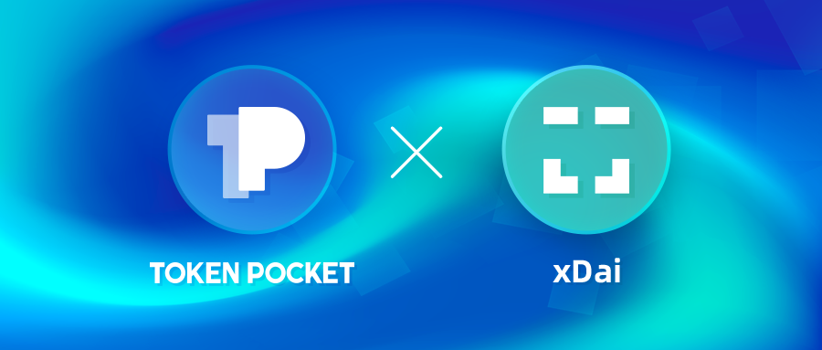

# How to add xDAI Chain through adding custom network？

1.Open TokenPocket, click the button in the upper right corner;

2. Drag down to the bottom of the page, click \[ Add custom network\];

3. Click \[Easy Add\] to directly add xDAI Chain;

4. Click \[xDAI Chain\];

5. Network parameters will be filled in automatically, and then click \[Save\];

6. You have successfully added xDAI Chain now, and you can click it to create or import xDAI Chain wallet.

**Note:** TokenPocket cannot verify the custom network, please add your trusted networks.

**Related tutorials**   
[How to create a wallet?](https://tphelp.gitbook.io/en/wallet-management/how-to-create-a-wallet)

[How to import a wallet?](https://tphelp.gitbook.io/en/wallet-management/how-to-import-a-wallet)

[Design a link to promote your chain](https://tphelp.gitbook.io/en/wallet-operation/design-a-link-to-promote-your-chain)

