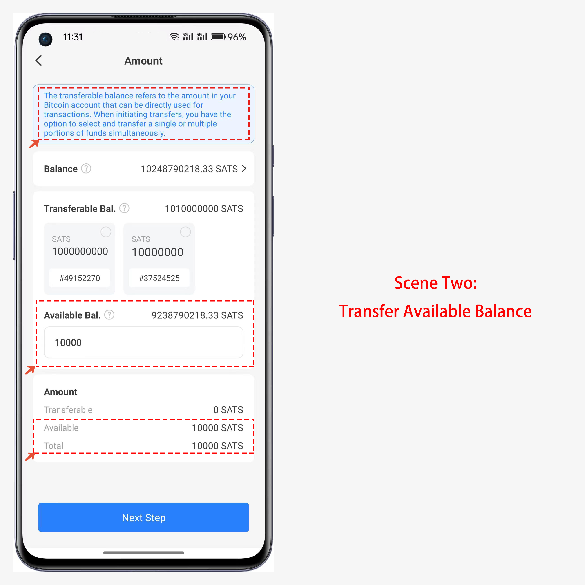

# EthereumPoW User Guide

### How to add EthereumPoW public chain in TokenPocket

1、Open TokenPocket, click Add Wallet in the top right corner, and click Add Custom Network at the bottom of the \[Select Network] screen

<figure><figcaption></figcaption></figure>

2、Open the custom network interface, click “Easy Entry” in the upper right corner, TokenPocket will list the popular public chains, and you can easily search for the public chains you need to add through the easy entry

Fill in the ETHW abbreviation in the search bar, and you can see the search results below, click it and ready to add.

<figure><figcaption></figcaption></figure>

3、Double check the information and click “Save” in the lower right corner to add it successfully. Go back to the “Select Network” interface and pull down to the bottom to see the newly added EthereumPoW network.

<figure><figcaption></figcaption></figure>

4、Click on the newly added chain, and you can choose “Create” or “Import” to use the ETHW wallet. Import your wallet and you can see the ETHW airdrop you received.

<figure><figcaption></figcaption></figure>

5、After adding the ETHW public chain, you can use the wallet address holding ETH to synchronize, open TokenPocket, click 【Details】, select 【Wallet Synchronization】, select ETHW public chain synchronization and switch to ETHW wallet.

<figure><figcaption></figcaption></figure>
