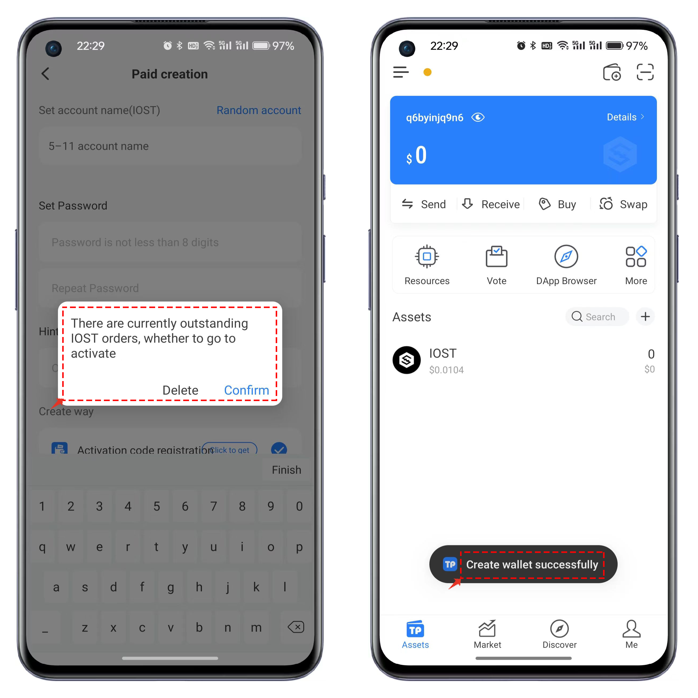

# IOST Use Guide（ Assist in creating）

Currently, TokenPocket only supports IOST on the Android platform. TP Wallet has not yet added support for the IOST network, and it is not possible to create an IOST wallet through custom network settings at the moment.

### <mark style="color:orange;">How to create an IOST wallet.</mark> 

1. Open TokenPocket and click on the first icon in the upper right corner, which is labeled "Add Wallet." In the search bar for single-network wallets, type in "IOST" for a quick search.

<figure><figcaption></figcaption></figure>

2. Click on the IOST public chain, and depending on your specific situation, you can either "Create Wallet" or "Import Wallet." For the purposes of this tutorial, let's choose to create a wallet. Click on "Create Wallet" and select " Create by Friend"

<figure><figcaption></figcaption></figure>

3. The IOST account consists of 5 to 11 characters, including lowercase letters, numbers, and \_. You can set it according to your preferences or click on the "Random Account" button on the interface. After setting the account, enter the password and click on the "Create Wallet" menu. In the prompt for the backup mnemonic phrase, you can click on "Advanced Settings" to create a wallet using the Passphrase method. In simple terms, a Passphrase wallet requires both the correct mnemonic phrase and the correct password for management, and both are necessary.

<figure><figcaption></figcaption></figure>

4. After successfully backing up and verifying the mnemonic phrase, you will reach the sharing interface for creating the IOST account. Here, you can click on "Invite Friends to Create" to share it with friends through social channels.

<figure><figcaption></figcaption></figure>

5. Users with an IOST wallet can open TokenPocket, click on the second icon in the upper right corner for the "Scan" function, scan the QR code created by a friend, and then enter the creation assistant interface. Advanced users can flexibly set the parameters for staking here, or simply click on "Register Now."

<figure><figcaption></figcaption></figure>

6. After successfully completing the payment, you will see a prompt indicating that the creation was successful.

<figure><figcaption></figcaption></figure>

7. After completing the assisted creation in the previous step, you can use the import function in the TokenPocket IOST wallet to start using the account. Alternatively, you can re-enter the wallet creation interface. If there is an unfinished order, you will see a prompt message. Clicking on "Confirm" and returning to the friend creation interface, you can click on "Active Account" to complete the entire registration process.

<figure><figcaption></figcaption></figure>

### <mark style="color:orange;">How to acquire IOST</mark> 

1. Open TokenPocket and select a wallet address that holds tokens, for example, choose the BSC wallet. On the wallet's homepage, click on "Swap," then use USDT on the BSC chain to exchange for IOST. Simply choose the desired tokens for exchange, meet the minimum exchange quantity, select a non-exchange receiving address, and finally click on "Confirm Swap."

<figure><figcaption></figcaption></figure>

2. On the transaction details page, after verifying that the information is correct, click on "Confirm," enter your password, and patiently wait for the cross-chain exchange to complete. The process shouldn't take too long.

<figure><figcaption></figcaption></figure>

