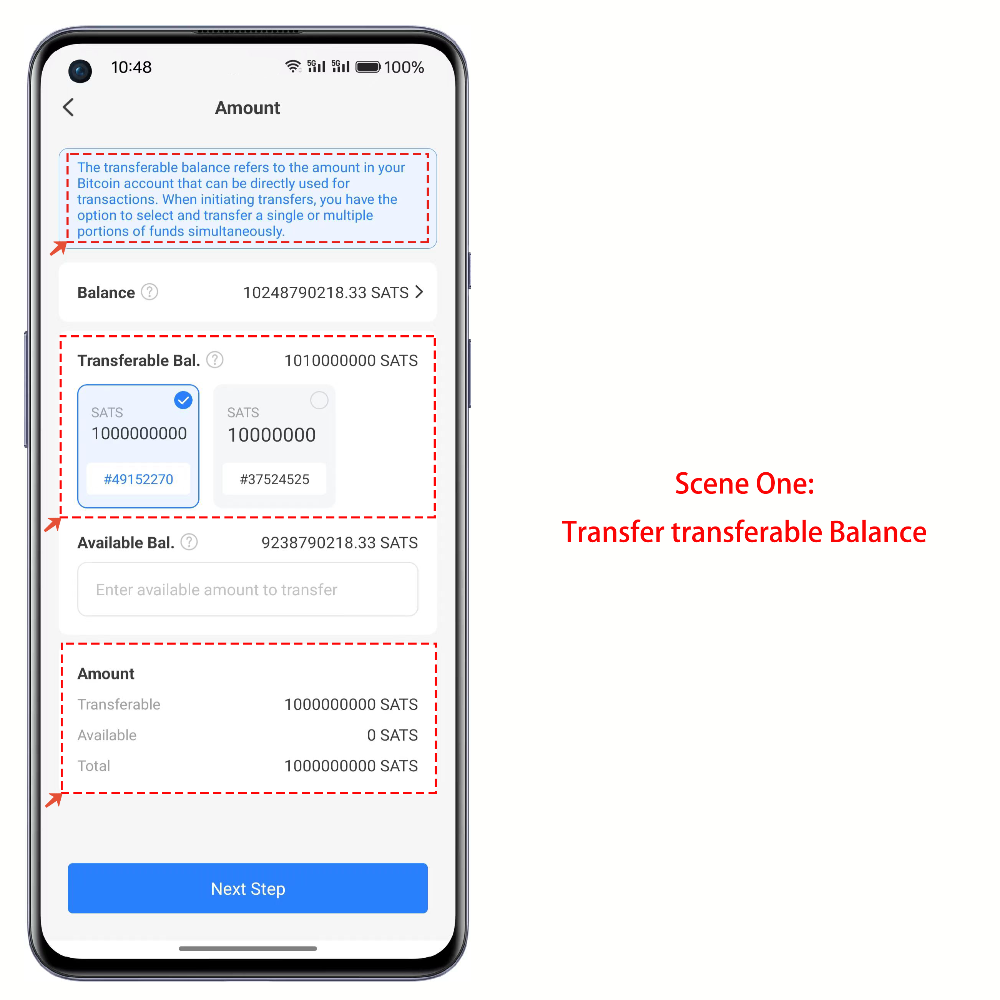

# opBNB Use Guide

### <mark style="color:orange;">**How to create a opBNB wallet in TokenPocket?**</mark> 

1. Open TokenPocket APP, click  on the upper right corner, and select opBNB;

<figure><figcaption></figcaption></figure>

2. Fill in the data in the custom network editing interface.

* Name: opBN TESTNET （自定义）
* RPC URL: https://opbnb-testnet-rpc.bnbchain.org
* Chain ID: 5611
* Currency symbol: tcBNB
* Block Explorer URL: https://opbnbscan.com

Clicking "Confirm" will complete the operation of adding a new custom network. Once added, you will be able to see it at the end of the list of available networks.

<figure><figcaption></figcaption></figure>

3. After clicking on the newly added opBNB public chain, you can choose to either "Create Wallet" or "Import Wallet" to create a wallet. Once the creation is complete, you will be able to access the main wallet interface.

<figure><figcaption></figcaption></figure>

### <mark style="color:orange;">How to add opBNB on TokenPocket  Extension Wallet?</mark>

1. Click on the upper-left corner to switch networks, and then click on "Custom RPC."

<figure><figcaption></figcaption></figure>

2. Input the following content in the custom network parameters, and after completion, click "Save" to successfully create the custom opBNB network.

<figure><figcaption></figcaption></figure>
