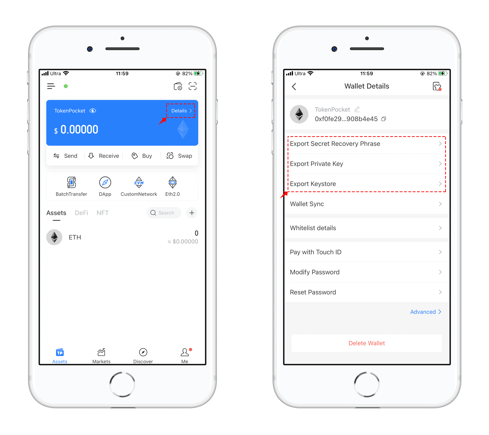
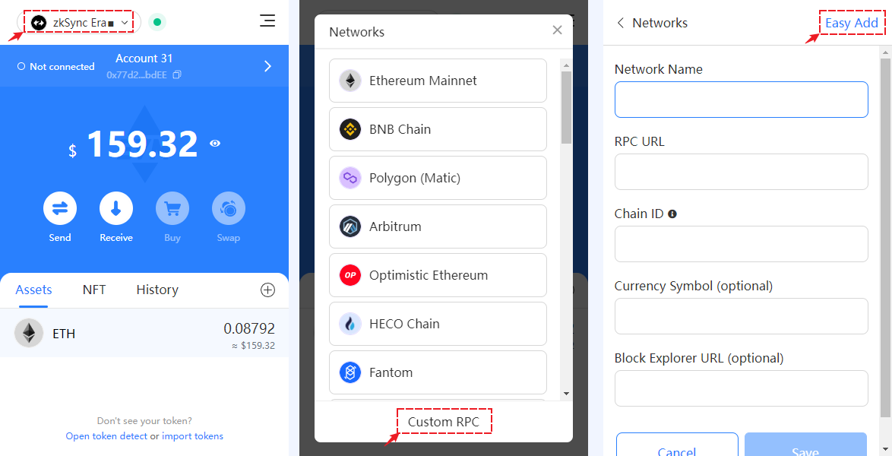
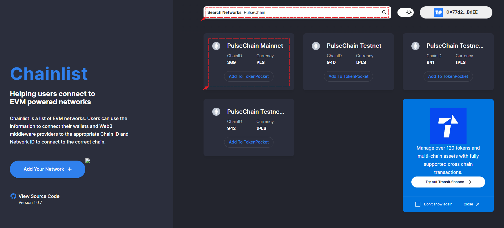

# Pulse Chain User Guide

### <mark style="color:orange;">How to add Pulse Chain on TokenPocket Moblie Wallet?</mark>

1、Open TokenPocket, click Add Wallet in the top right corner, and click【Add Custom Network】.

<figure><figcaption></figcaption></figure>

2\. Open the custom network interface, and click 【Easy Add】 in the upper right corner, TokenPocket will list the popular public chains, and you can easily search for the public chains you need to add through this entrance.

Fill in 【Pulse】  in the search bar, and you can see the search results below, click it and be ready to add PulseChain.

<figure><figcaption></figcaption></figure>

3\. Double-check the information and click “Confirm”. Go back to the “Select Network” interface and pull down to the bottom to see the PulseChain.

<figure><figcaption></figcaption></figure>

4\. Click on the PulseChain, and you can choose “Create” or “Import” to use the Pulse wallet.&#x20;

<figure><figcaption></figcaption></figure>

### How to add PulseChain on TokenPocket  Extension Wallet?

1. Click the upper left corner to switch networks, click  【Custom RPC】, and click 【Easy Add】.

<figure><figcaption></figcaption></figure>

2. Fill in 【PulseChain】  in the search bar, and you can see the search results below, click it and be ready to add PulseChain. Click 【Connect Wallet】 and choose a wallet you want to sync up as a PulseChain wallet, click【Add to TokenPocket】.

<figure><figcaption></figcaption></figure>
