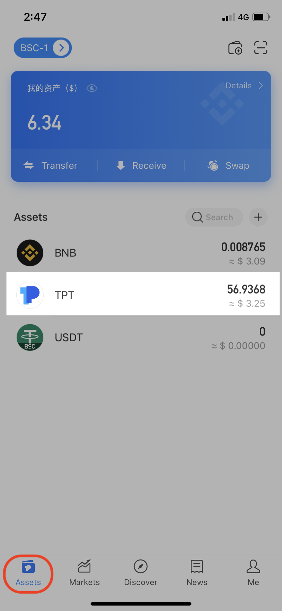
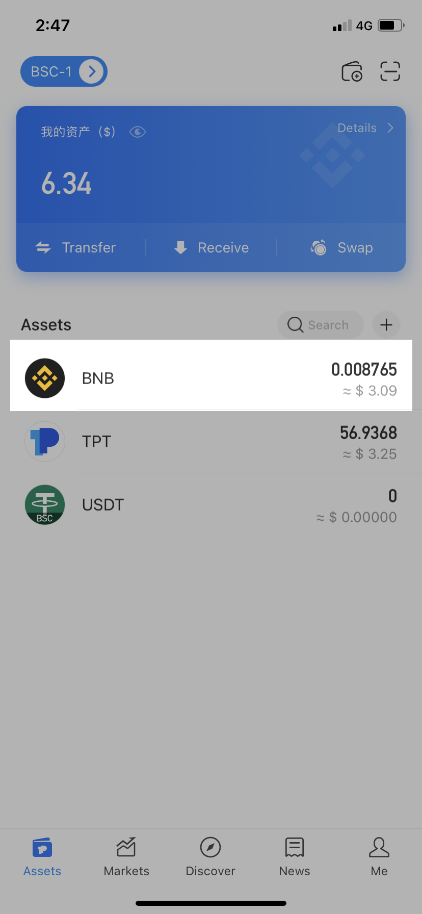

# How to Submit a Token Logo?

Please select the corresponding link on [GitHub ](https://github.com/TP-Lab/tokens)according to the token type when submitting a token logo/info. It will be regarded as invalid if the token information file is not included.

Ethereum：[https://github.com/TP-Lab/tokens/tree/master/eth](https://github.com/TP-Lab/tokens/tree/master/eth)​‌

BSC：[https://github.com/TP-Lab/tokens/tree/master/bsc](https://github.com/TP-Lab/tokens/tree/master/bsc)​‌

HECO：[https://github.com/TP-Lab/tokens/tree/master/heco](https://github.com/TP-Lab/tokens/tree/master/heco)​‌

TRON：[https://github.com/TP-Lab/tokens/tree/master/tron](https://github.com/TP-Lab/tokens/tree/master/tron)​‌

EOS：[https://github.com/TP-Lab/tokens/tree/master/eos](https://github.com/TP-Lab/tokens/tree/master/eos)​‌

HSC：[https://github.com/TP-Lab/tokens/tree/master/hsc](https://github.com/TP-Lab/tokens/tree/master/hsc)‌

OKExChain: [https://github.com/TP-Lab/tokens/tree/master/okexchain](https://github.com/TP-Lab/tokens/tree/master/okexchain)

Polygon \(Matic\): [https://github.com/TP-Lab/tokens/tree/master/polygon\(matic\)](https://github.com/TP-Lab/tokens/tree/master/polygon%28matic%29)

### **Preparation**

**1. Image of the Token Logo**


```text
File Extension: png . Uppercase PNG is considered invalid
File Name：logo.png
Size: 256px by 256px
Background: transparent is recommanded.
```


**Tip:**   
There are two online services recommended to edit your image:

* [onlinepngtools](https://onlinepngtools.com/resize-png), to resize the image to 256 x 256


* [TinyPNG 426](https://tinypng.com/), to optimize the image size.


**2. Token Information File**


```text
File Extension: json . Uppercase JSON is considered invalid
File Name：info.json
```


The following information must be included in the _info.json_ file. Please make sure that the details are correct and follow the format requirements. The contract address should follow the checksum address format. \(Please refer to the sample below\)

Note: Your request will not be allowed if there is wrong info or formate in your files.

```text
{
 "name": "TokenPocket Token",
 "website": "https://tokenpocket.pro",
 "description": "A leading multi-chain wallet that supports BTC, ETH, BSC, HECO, TRON, EOS, OKExChain, HSC and so on.",
 "explorer": "https://bscscan.com/token/0xeca41281c24451168a37211f0bc2b8645af45092",
 "type": "BEP20",
 "symbol": "TPT",
 "decimals": 4,
 "status": "active",
 "id": "0xECa41281c24451168a37211F0bc2b8645AF45092"
}
```


**3.** [**Checksum Address** ](https://docs.ethers.io/v5/api/utils/address/#:~:text=If%20the%20case%20is%20mixed,will%20return%20a%20Checksum%20Address.)

For ERC20 tokens, you need to submit the checksum address that includes uppercase and lowercase characters. You can find the checksum address of a token by searching contract address on [Etherscan](https://etherscan.io/). After searching, the checksum address will be shown in the upper left corner. For example, the checksum address of USDT is 0x6B175474E89094C44Da98b954 EedeAC495271d0F.


Or you may click the [converter tool](https://piyolab.github.io/sushiether/RunScrapboxCode/?web3=1.0.0-beta.33&code=https://scrapbox.io/api/code/sushiether/web3.js_-_Ethereum_%E3%81%AE%E3%82%A2%E3%83%89%E3%83%AC%E3%82%B9%E3%82%92%E3%83%81%E3%82%A7%E3%83%83%E3%82%AF%E3%82%B5%E3%83%A0%E4%BB%98%E3%81%8D%E3%82%A2%E3%83%89%E3%83%AC%E3%82%B9%E3%81%AB%E5%A4%89%E6%8F%9B%E3%81%99%E3%82%8B/demo.js) to convert Etherscan address to checksum address

\*\*\*\*

**Fees for Submissions**  
Please be noted that there will be **1000 TPT** for **every token logo/info** submission, and this transfer is **irreversible**. Please follow the steps below to transfer after the above preparation is completed \(BSC chain is taken as an example here\): ‌

1.Open TokenPocket App, click \[Assets\] on the bottom, choose TPT Token, and then click \[Transfer\] to proceed.

  

2. Click \[Transfer\], enter receiving address and 1000 TPT amount, Click \[Confirm\] after choosing fee, and then click \[Transfer\] after confirming the information.

**Note**: Receiving address is **0x7837AE9E4FD6E967F1B8C8824D6288ECE6e730F9** \(Also can scan QR code below to get receiving address\). **Only support to receive TPT in BSC, HECO and Ethereum chain.** Please double confirm your transfer information! 

  

3. Back to \[Assets\] after transferring 1000 TPT successfully, choose BNB Token, click \[Transfer\] to proceed.



4. Enter receiving address \(same as above\) and 0 BNB \( If 0 BNB transfer is not supported, you can enter a very small amount and try it again\), choose fees and then click \[Advanced\] - \[Plain\] in the bottom right corner to enter the text required on \[Chain Data\] according to the format.

\(Format requirement: The chain of the Token submission - Smart contract of the Token submission - Transaction ID for 1000 TPT. \)  
For example: BSC - TPT - 0xeca41\*\*\*168a372c2b8645af45092 - [https://bscscan.com/tx/0xe\*\*\*a99411774b48d8c40a71fb35220b42fa505aa5dd](https://bscscan.com/tx/0xe6e7be7680ea438a36eb5463a99411774b48d8c40a71fb35220b42fa505aa5dd)


5. Click \[Transfer\] after confirming the transaction detail.


### **Steps of Adding a Token Logo/Info**

After completing the above information, you can add the token logo and information file on [GitHub](https://github.com/TP-Lab/tokens). Please refer to the steps as following:

1. Create a folder with the token contract name**\(Checksum format\)**. Drag both `info.json` and `logo.png` inside the folder.


2. Go to [GitHub](https://github.com/TP-Lab/tokens), click \[Fork\] in the top right corner and wait to complete. 


3. Navigate to the chain folder you want to add the logo and info file, and keep this window open. \(Take BSC chain folder as an example here\)


4. Go back to the folder you have created on Step 1, and then drag and drop the created folder to the active window on Step 3.


5. In the \[Commit changes\] box: Fill up the Token information in the subject line and additional description you want to add in the content field, and then click \[Commit changes\].

**Note:** Please add the 1000 TPT transaction ID link in the content description, otherwise it will not pass the review.


  
6. The page will revert back to the forked token screen, and then click \[Pull Request\].


  
7. Click \[Create a pull request\] to proceed.


8. The screen will now show more details about the Token information you are about to submit. Click \[Create pull request\] again.


9. Fill up the subject line and provide additional details about your request on the \[Open a pull request\] screen, and then click \[Create pull request\]. 


10. Now, you have successfully submitted your Pull request. our admin will verify your request before it gets approved.


### **How to Get Approved? ‌** 

Pull requests will be verified before being added to the Token repository. Therefore, please check whether the Token files you submitted meets the following requirements:‌ 

* Fees of 1000 TPT are paid
* Projects have no counterfeit or fraudulent behavior
* Detailed token information 

**Disclaimer** 

TokenPocket team allows anyone to submit a token request to this repository. But, this does not mean that we have direct partnerships with all of the projects. ‌ After careful review, if any scam or fraudulent projects are found, TokenPocket team will reject submissions. Due to the changing market conditions, risk of fraud or any other factors we deem relevant, TokenPocket team reserves the right to change the terms of submission at any time.


### When Will the Token Logo/Info be Added? <a id="when-will-the-asset-be-added"></a>

After further verification, the admin will merge the pull request within 5 business days. If there are any additional needs or errors that need to be corrected, we will correct information based on the chain. ‌

 After the admin merges the Pull request, the token logo can be updated. **And please do not send the same request repeatedly. Your patience will be appreciated.**

