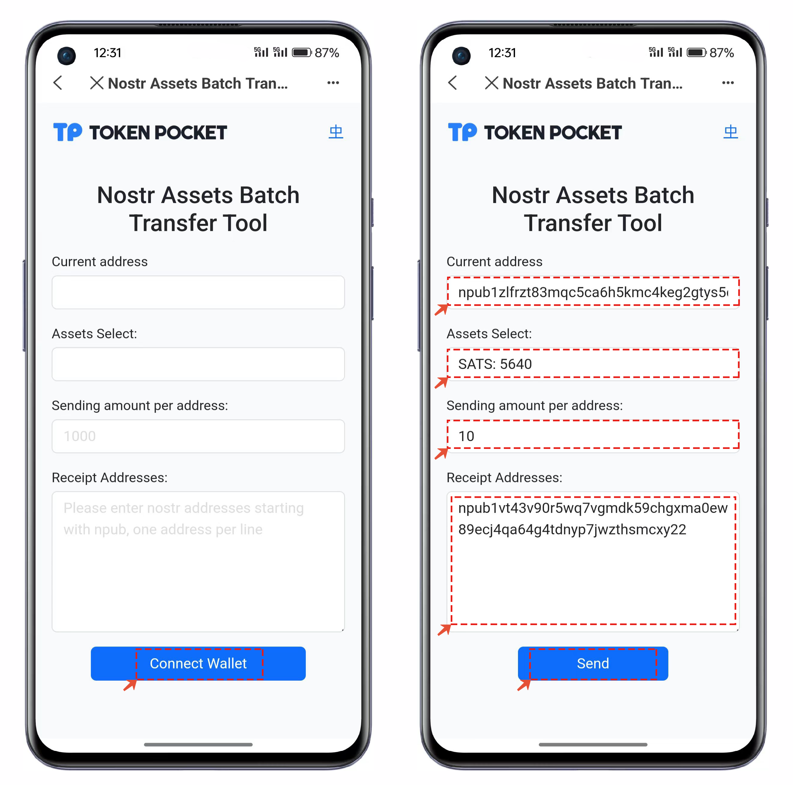

# Base Goerli chain and Goerli chain assets are interoperable.

#### Exchange Goerli for Base Goerli Token.

1.Open the Goerli public chain wallet, click on the tool link for exchange in the top bar of the "Discovery" page and open https://bridge.base.org/deposit.

<figure><figcaption></figcaption></figure>

2.Opening the DApp will automatically complete wallet connection, and the default state is Deposit. You only need to set the amount of tokens that need to be exchanged on the Goerli chain. For example, if we set the exchange quantity as 0.2, after filling it in, click 【DEPOSIT ETH】and then click 【Confirm Payment】in the transaction interface that pops up. The token exchange usually takes a few minutes.

<figure><figcaption></figcaption></figure>

#### Exchange Base Goerli for Goerli tokens.

1.Open the Base Goerli public chain wallet, click on the top bar of the \[Discover] page, fill in the exchange tool link and open https://bridge.base.org/deposit.

<figure><figcaption></figcaption></figure>

2.Opening the DApp will automatically complete wallet connection. Click on the \[Withdraw] menu, set the amount of tokens to be exchanged on Base Goerli chain that you want to exchange. For example, if we set the exchange quantity as 1 and fill it in, click \[Withdraw]. In the transaction interface that pops up, click \[Confirm Payment]. Token exchange usually takes a few minutes.

<figure><figcaption></figcaption></figure>
