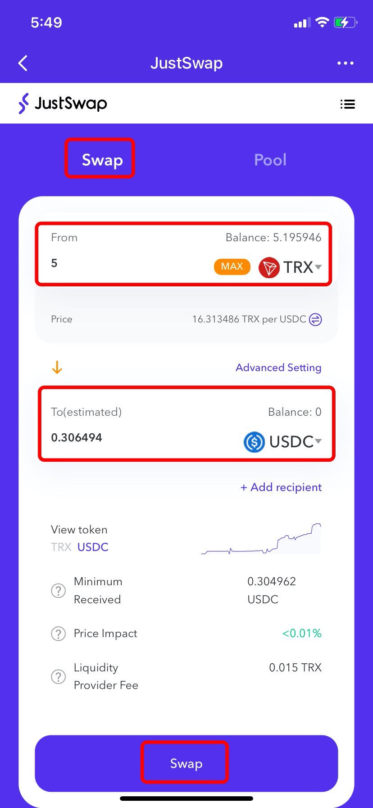
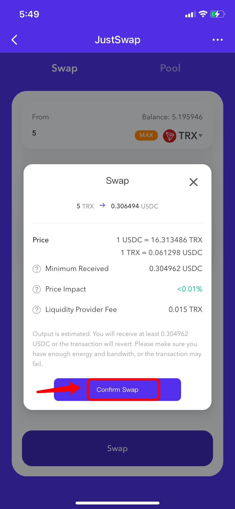
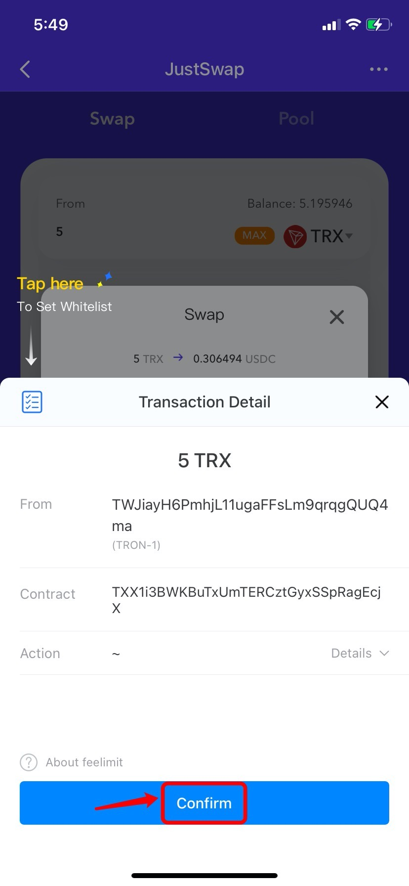
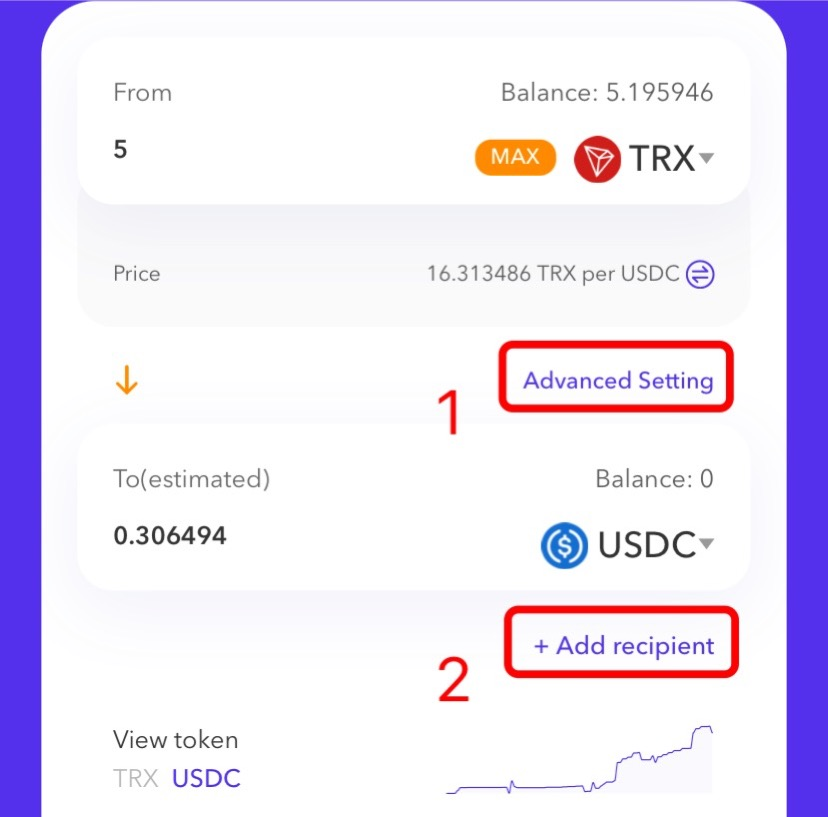
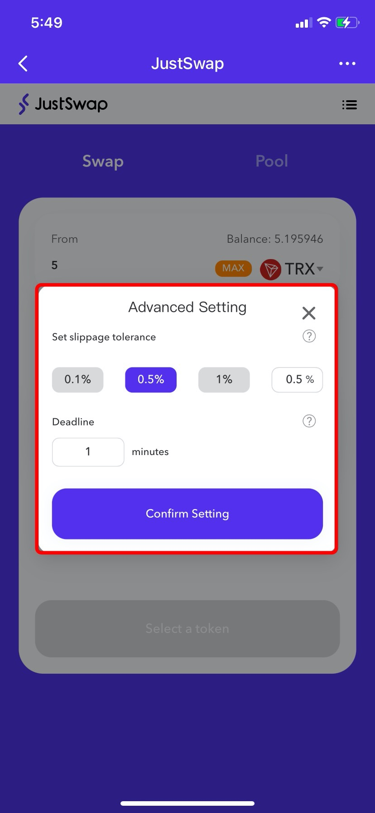
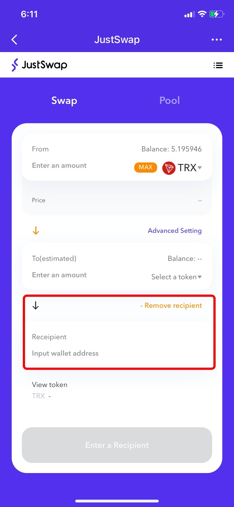

# JustSwap on Tron Gudie

**About** [**JustSwap**](https://just.network/)\
JustSwap is a TRON-based decentralized trading protocol for automated liquidity provision and an open financial market accessible to all. It holds many functions like Swap, LP Pools, etc.

**How to Swap on JustSwap Through Tron?**

1.Open TokenPocket App, choose Tron network wallet, click \[Discover] at the bottom, and then search \[JustSwap] to enter;

2\. After entering the JustSwap page, Click \[Swap] at the top, select the swap token, enter the amount, and select the receiving token, then the receiving amount will be filled in automatically. Click \[Swap] to proceed. (Take exchanging TRX for USDC as an example here)

Tip: You can paste the contract address on the search bar to select token.

3\. Click \[Confirm Swap] after you double confirm the swap information.

4\. Click \[Confirm] and enter your wallet password to complete the swap.

**Reminders:**

1**)** Click \[Advanced Setting] can set slippage tolerance and swap deadline

2\) Click \[Add recipient] can input receiving wallet address.

**Click** [**Here**](https://justswap.zendesk.com/hc/en-us) **to contact JustSwap**&#x20;


_This tutorial is only for the DApp in the wallet side of the operation guide, does not represent the investment advice of TokenPocket. Investing involves risks, you should be fully aware of the risks and make your own investment decisions._


