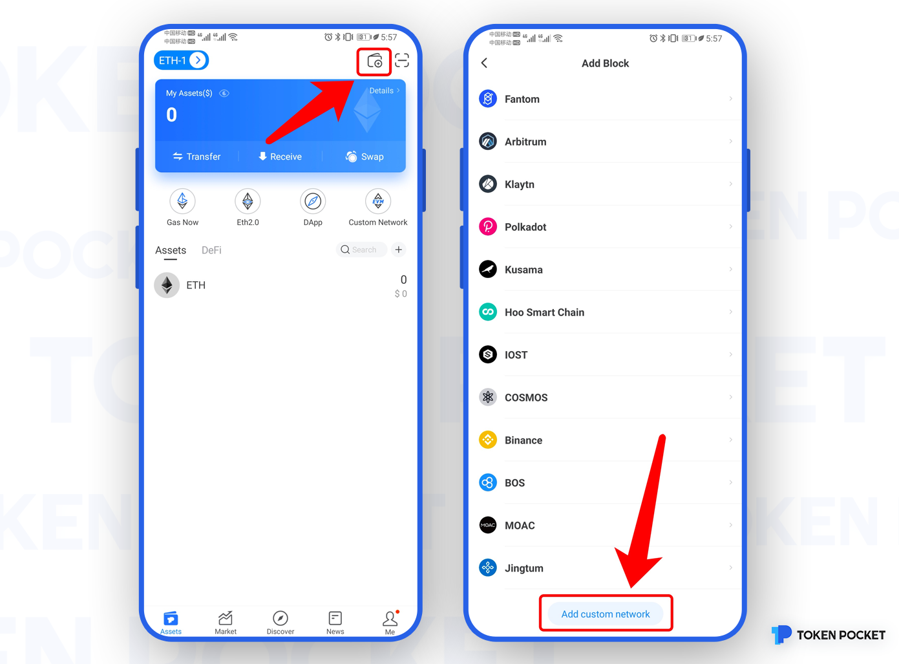
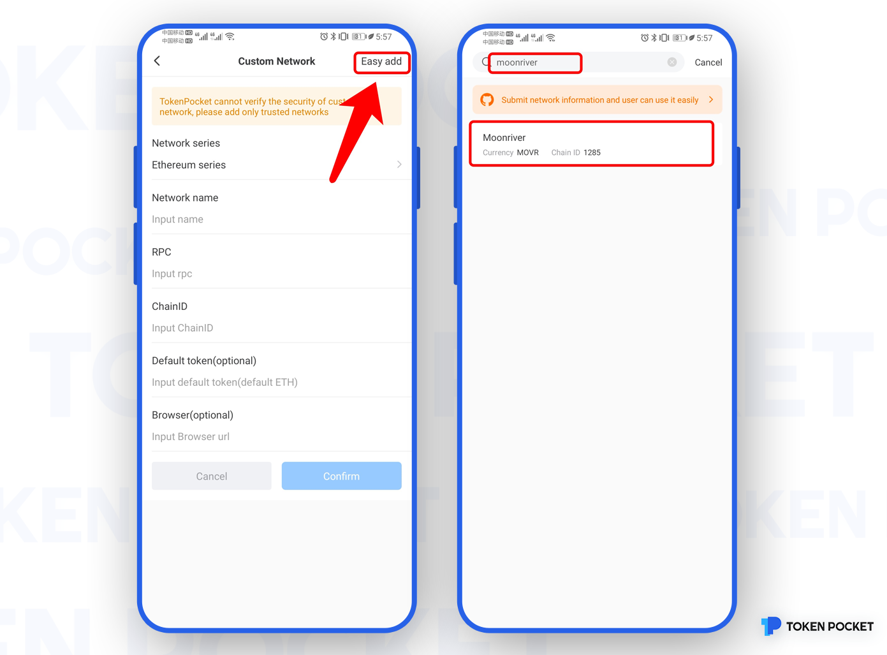
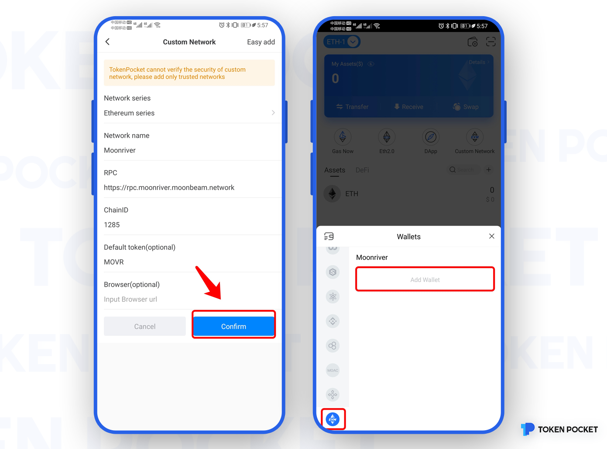

# Moonriver-Add Custom Network Guide

1\. Open TokenPocket APP, click the \[Wallet] pattern in the upper right corner, enter the page of \[Add Block] and pull to the bottom, click \[Add custom network];

2\. Click \[Easy add], and search the \[Moonriver], then the system will display the Moonriver Network，click \[Moonriver];

3\. Enter the page of \[Custom Network], click \[Confirm], at this point, you have added the Moonriver Network successfully。

You can click \[Add Wallet] to create/import/sync Moonriver wallet in the page of Assets.

