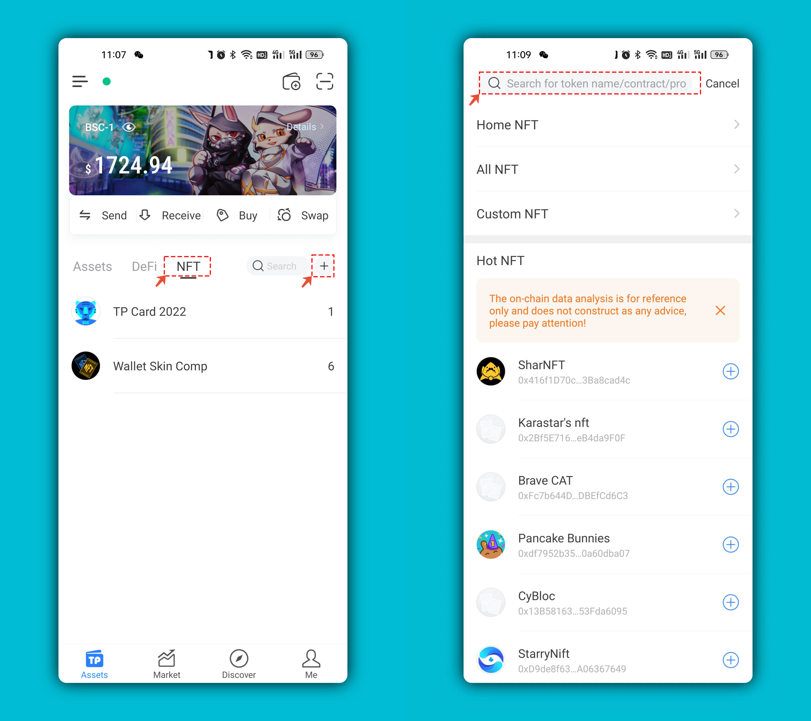
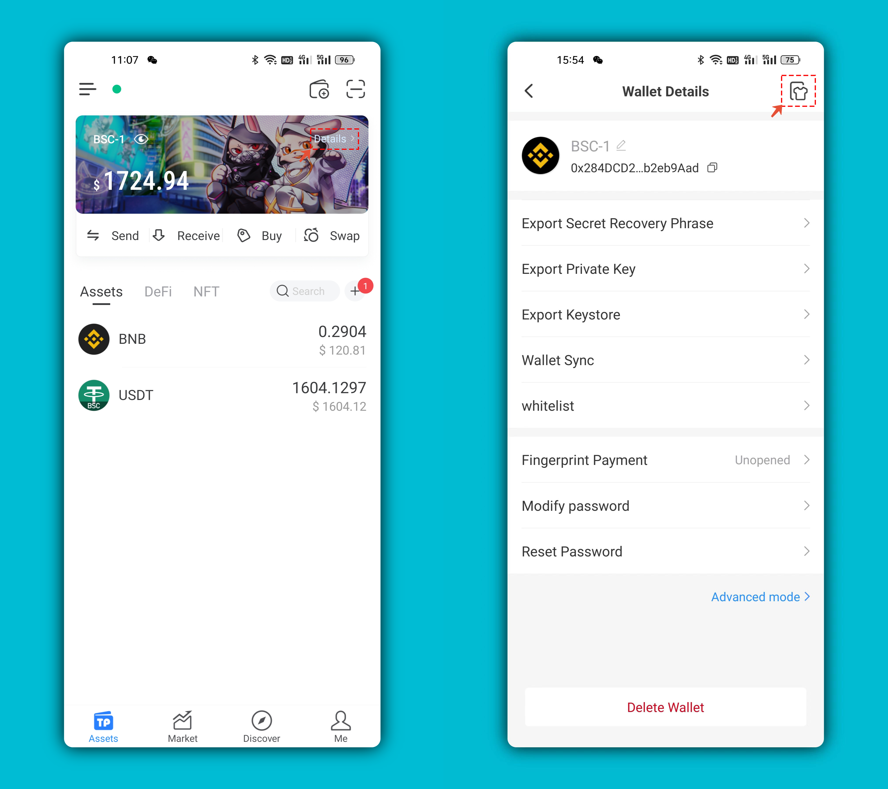
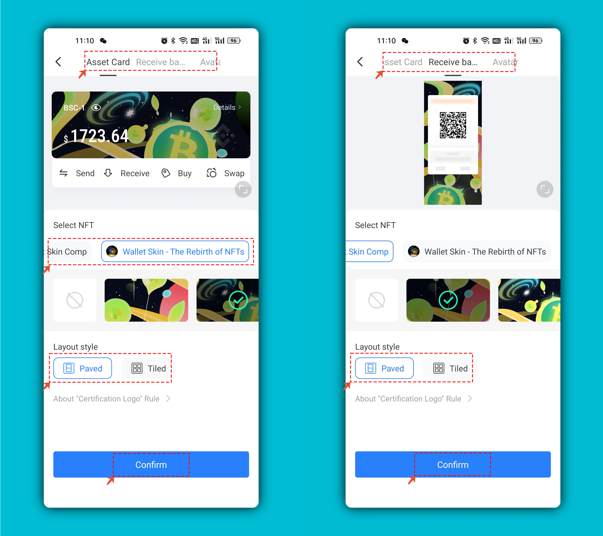

# NFT skin design competition tutorial

1、Open the TP wallet, click \[Discover] to enter the DApp in the New Product area or the recommended position. If you are an iOS user, you can directly use the link to access.

 (1).png>)

2、In the minting page, you can fill in the name to search, and choose different public chains. After finding your favorite skin, click \[Minting] to start authorization. you can also click 5Degrees to follow each other, or click the twitter bird to find the author's more information.

.png>)

3、the gas fee can be flexibly set in the \[Transaction Details]. Since the gas fee of the BSC chain is relatively stable, it can be selected by default, or you can choose a higher fee to make the transaction faster.

.png>)

4、After completing the authorization, go back to the Assets page, click the \[NFT] menu, and click \[ +] on the right, then fill in the below contract address on the search bar at the top to add the skin token (It will support automatic display of NFT tokens you hold and the adding contract addresses in the NFT skin interface later).&#x20;

**Contract address: 0x749ca2666D20d659c25952f8FAa249eC5Ae72189**

5、After adding NFT tokens, return to the Assets page, and click \[Details] in the upper right corner, then click the skin icon in the top right to set.

6、you can set skin for \[Asset Card], \[Receive Background] and \[Avatar] three positions. Select the NFT, find the background you like to pave or tile, and click OK after obtaining the best effect. That is done.

